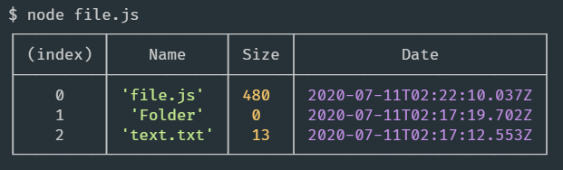
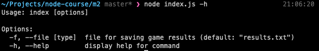
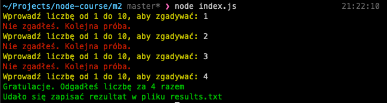

- [System modułowy Node.js](#system-modułowy-nodejs)
- [Globalne zmienne](#globalne-zmienne)
- [Moduły](#moduły)
- [Moduły ComonJS](#moduły-comonjs)
- [Moduły ECMAScript](#moduły-ecmascript)
- [Praca z plikami](#praca-z-plikami)
- [Tworzenie aplikacji konsolowych](#tworzenie-aplikacji-konsolowych)


# System modułowy Node.js
# Globalne zmienne
 Aby zmienna w Node.js była dostępna globalnie, trzeba zadeklarować ją jako właściwość obiektu Global.

 ```js
 global.foo = 3;
```
Obiekt Global to odpowiednik obiektu window z przeglądarki. Metoda require, służąca do połączenia modułów nie jest globalna i będzie lokalna dla każdego modułu.

Również lokalnymi dla każdego modułu są:

- module.export – obiekt odpowiadający za to, co dokładnie będzie eksportować moduł gdy zażądamy go przy wykorzystaniu require;
- __filename – nazwa pliku wykonywanego skryptu;
- __dirname – absolutna ścieżka do wykonywanego skryptu.

Wrócimy do nich trochę później i przeanalizujemy je bardziej szczegółowo, gdy przyjrzymy się podłączaniu modułów w Node.js.

W sekcji Global znajdują się między innymi takie klasy, jak:

- Buffer – klasa wykorzystywana do operacji z danymi binarnymi.
- process – obiekt w którym znajdują się informacje o danym procesie Node.js

Na przykład właściwość process.argv będzie zawierać tablicę argumentów polecenia podanych przy uruchamianiu skryptu w Node.js. Zerowym elementem będzie ścieżka absolutna dla Node.js, drugim ścieżka pliku który został uruchomiony a następnie dostępne będą podane parametry.

Do pracy z katalogami wykorzystuje się następujące funkcje: 

- process.cwd() zwraca ścieżkę obecnego katalogu roboczego,
- process.chdir() wykonuje przejście do innego katalogu. Polecenie
- process.exit() kończy proces ze wskazanym jako argument kodem: 0 - poprawne zakończenie działania, inne statusy np. 1 – oznaczają błąd.

Ważna metoda process.nextTick(fn) zaplanuje wykonanie podanej jako callback funkcji w taki sposób, że zostanie wykonana przed zakończeniem bieżącego “obrotu” Event Loop, (nazwa funkcji może być tutaj nieco myląca, aby przesunąć wykonanie funkcji na następny tick możemy użyć setImmediate)


```js
// jest uzywana na koniec event loopa
setImmediate(function () {
  console.log("setImmediate callback");
});

// uzywa sie zeby jeszcze przed wszystkim na poczatku
// wcisnac jaks funkcje
process.nextTick(function () {
  console.log("NextTick callback");
});

// NextTick callback
// setImmediate callback
```

Obiekt process zawiera jeszcze wiele właściwości i metod, z którymi można zapoznać się samodzielnie w dokumentacji do Node.js.

# Moduły

Do podłączenia dodatkowych modułów do twojego projektu w Node.js można zastosować wygodny system zarządzania modułami NPM. Najprościej rzecz ujmując: z jednej strony jest to publiczne repozytorium dla Node.js zawierające stworzone przez społeczność moduły czy biblioteki. Z drugiej strony jest to też narzędzie który instalujemy razem z Node.js i dostępne przez:

Polecenie npm które pozwala tworzyć, usuwać lub aktualizować potrzebne ci moduły, automatycznie uwzględniając przy tym wszystkie zależności wybranego przez ciebie modułu od innych modułów uzupełniających. Instalacja modułu nastąpi po wykonaniu polecenia:

```js
npm install nazwa-paczki@wersja-paczki flagi
```

Biorąc pod uwagę to, że wszystkie publiczne moduły NPM można łatwo zainstalować przy pomocy npm, dla twojego projektu należy stworzyć plik package.json z listą wszystkich niezbędnych do pracy zależności i później zainstalować na serwerze wszystkie potrzebne moduły dzięki poleceniu:

```
npm install
```

Podstawowe flagi przy instalacji to:

- -S lub --save - moduł instaluje się jako podstawowa zależność. Oznacza to, że moduł jest niezbędny do normalnego funkcjonowania programu niezależnie do tego gdzie jest uruchomiony. W pliku package.json znajdziemy go potem pod kluczem dependancies
- -D lub --save-dev - oznacza, że moduł zainstaluje się w devDependencies - czyli jest potrzebny tylko podczas developmentu, a nie w środowisku produkcyjnym.
- -g czyli global - pozwala zainstalować moduł do wykorzystania w dowolnym projekcie na danej maszynie.

Moduły należą do jednej z trzech kategorii:

- bazowe (core modules)
- plikowe (file modules)
- moduły npm (npm modules)

Nazwy bazowych modułów są zarezerwowane i nie powinny być nadpisywane; moduły takie jak fs i os, dostarcza nam środowisko Node.

File Module – gdy tworzysz plik w którym przypisane zostało coś (funkcja, obiekt, itd.) do właściwości module.exports, a później plik ten jest wykorzystywany w innych plikach twojego programu to mówimy o module plikowym.

Moduły npm – to w zasadzie moduły plikowe (często rozbite na wiele plików), które znajdują się w specjalnym folderze o nazwie node_modules.

Gdy wykorzystujesz funkcję require, Node określa typ modułu na podstawie podanej ścieżki/nazwy.

Jeżeli wskażesz moduł który nie jest jednym z core modules, to Node.js będzie szukał w bieżącym katalogu podkatalogu node_modules.

Jeżeli to nie zakończy się sukcesem, to Node.js przejdzie do katalogu-rodzica i znów zacznie szukać katalogu node_modules, i następnie szukał tam modułu.

Proces będzie się powtarzał, dopóki moduł nie zostanie znaleziony lub nie zostanie osiągnięty katalog root.

 # Moduły ComonJS

 Node.js pracuje z systemem podłączania modułów CommonJS. Każdy moduł CommonJS reprezentuje gotowy do wykorzystania fragment kodu JavaScript, który eksportuje obiekty specjalne który możemy używać w dowolnej ilości miejsc. Dwa główne narzędzia modułów CommonJS to:

- obiekt module.exports zawierający to, co moduł chce uczynić dostępnym dla innych części systemu
- funkcja require, która jest wykorzystywana przez jedne moduły do importu obiektu exports z innych.

Stwórzmy plik/moduł module.js

```js
const info = msg => {
  console.log(`Info: ${msg}`);
};

const log = msg => {
  console.log(`Log: ${msg}`);
};

module.exports = {
  info,
  log,
};
```

Konstrukcja module – specjalny obiekt, który jest dostępny w Node.js w celu realizacji modułów Common.js. Wszystko to, co będzie przypisane jego właściwości exports, będzie eksportować się z tego modułu.

W innym pliku, main.js, podłączymy ten moduł i wywołajmy eksportowane funkcje:

```js
const logger = require('./module');

logger.info('info function');
logger.log('log function');
```

# Moduły ECMAScript

Zaczynając od wersji: 6.х Node.js wspiera również podłączenie modułów zgodnie ze standardem ECMAScript. Jednak pełne importowanie działa dopiero z wersją 14.x.

Aby wykorzystać moduły ECMAScript musimy skorzystać z jednego z dwóch sposobów. Pierwszy – dodać do plików rozszerzenie .mjs, abyśmy mogli wykorzystać moduły ECMAScript lub drugi – w pliku package.json utworzyć pole "type" z wartością "module". Wykorzystamy drugi sposób i najpierw utworzymy w pustym folderze plik package.json przy pomocy polecenia:

```
npm init -y
```
i dodamy w nim pole "type" z wartością "module".

Później utworzymy moduł import.js.

```js
export const info = msg => {
  console.log(`Info: ${msg}`);
};

export const log = msg => {
  console.log(`Log: ${msg}`);
};
```

W pliku app.js importujemy wskazany moduł i wywołujemy funkcję:
```js
import { info, log } from './import.js';

info('info function');
log('log function');
```
W ten sposób zrealizowaliśmy drugie podejście podłączenia modułów czyli ECMAScript.

# Praca z plikami
Moduł FileSystem (fs) pozwala na pracę z plikami w Node.js. Obecnie najczęściej korzystamy z jego wersji promise, dzięki czemu nie musimy korzystać ze składni callback-ów.
```js
const fs = require('fs').promises;
```

Najczęściej wykorzystywane funkcje do podstawowych operacji na plikach to:

- fs.readFile(filename, [options]) - czytanie pliku;
- fs.writeFile(filename, data, [options]) - zapis pliku;
- fs.appendFile(filename, data, [options])dodanie do pliku;
- fs.rename(oldPath, newPath) - zmiana nazwy pliku;
- fs.unlink(path, callback) - usunięcie pliku.

Przy operacjach z plikami nigdy nie powinniśmy zapominać o obsłudze błędów.

Należy również pamiętać, że parametr data w funkcji readFile, zawiera obiekt będący instancją klasy Buffer, zawierający ciąg przeczytanych bajtów, to znaczy surowe dane.

W przypadku prostych plików tekstowych możemy przekonwertować data metodą toString():

```js
fs.readFile('readme.txt')
  .then(data => console.log(data.toString()))
  .catch(err => console.log(err.message));
```

Istnieją również metody modułu fs z synchronicznymi wersjami, kończące się na Sync, jak również i wersje przyjmujące callback.

Możemy je importować poprzez:

```js
const fs = require('fs');
```

Wtedy wszystkie funkcje nie zwracają promise więc nie możemy wykorzystać składni .then. Funkcjom synchronicznym nie jest również potrzebny callback, ponieważ są one blokujące i dlatego też nie są rekomendowane, chyba że wymaga tego obecne zadanie i dobrze rozumiesz, w jakim celu je stosujesz. Zobaczmy przykłady:

**readFileSync**

```js
try {
  const data = fs.readFileSync("readme.txt");
  console.log(data.toString());
} catch (err) {
  console.log(err.message);
}
```
**readFile** (wersja bez promise)

```js
const fs = require("fs");

fs.readFile("readme.txt", function (err, data) {
  if (err) {
    console.log("error", err.message);
  } else {
    console.log(data.toString());
  }
});
```

Napiszmy skrypt files.js, który będzie odczytał obecny katalog i wyprowadzał do konsoli jego zawartość: nazwę pliku, jego rozmiar i datę wprowadzenia ostatniej zmiany w pliku.

```js
const fs = require('fs').promises;

fs.readdir(__dirname)
  .then(files => {
    return Promise.all(
      files.map(async filename => {
        const stats = await fs.stat(filename);
        return {
          Name: filename,
          Size: stats.size,
          Date: stats.mtime,
        };
      }),
    );
  })
  .then(result => console.table(result));
```
Przeanalizujmy ten kod bardziej szczegółowo. Na początku podłączamy standardowy moduł fs w wersji z promisami:

```js
const fs = require('fs').promises;
```

Przy pomocy ścieżki ze zmiennej __dirname odczytujemy wszystkie pliki z obecnego katalogu.

W rezultacie działania funkcji readdir, w zmiennej files otrzymujemy promise który zwróci tablicę nazw plików i katalogów z obecnego katalogu.

Zwracamy więc tablicę promisów gdzie każdy analizuje kolejny element files

Zmienna stats zawierać będzie szczegółowe informacje o każdym kolejnym pliku i katalogu.

Zwracamy obiekt z nazwą pliku oraz 

- stats.mtime - czas ostatniej zmiany pliku
- stats.size - który określa rozmiar pliku w bajtach.

Rezultat wykonania tego promise, czyli zmienną result, przekazujemy funkcji console.table i dzięki niej wyświetlimy tabelkę z informacjami przy wykonaniu naszego skryptu w konsoli.

**Wynik wykonania skryptu:**


Rys. 1 - wynik wykonania skryptu

# Tworzenie aplikacji konsolowych

Aplikacje konsolowe (CLI applications) - to takie który uruchamiamy poprzez terminal, tradycyjnie precyzujemy działanie takich poleceń poprzez przekazywanie parametrów przy ich wywoływaniu. Skrót CLI (command-line interface) tłumaczy się jako 'wiersz poleceń', ale dla niektórych systemów operacyjnych lub programów mówimy też właśnie o terminalu (np. dla VSC lub MacOS).

W poprzednim module zauważyliśmy, że przekazane parametry przy uruchomieniu skryptu są dostępne w tablicy process.args w postaci: ```["/path/to/node", "/path/to/yourScript.js", "param 1", "param 2", …].```

Aby otrzymać same parametry należy więc wykonać polecenie ```process.argv.slice(2)```, który zwróci tablicę ze wszystkimi rozdzielonymi spacjami wartościami: ```["param 1", "param 2"```, …].

Opracowywanie wszelkiego rodzaju kombinacji parametrów i ich formatów jest bardzo niewygodne. Z tego powodu zazwyczaj wykorzystuje się dodatkowe moduły npm. Jeden z najpopularniejszych, którego będziemy używać, to moduł ```commander```.

Dodatkowo możemy wykorzystać wprowadzanie danych w konsoli przez użytkownika zgodnie poprzez schemat pytanie-odpowiedź, będziemy do tego wykorzystywać moduł Node.js ```readline```. Inicjalizacja jest dość prosta:

```js
const readline = require('readline');
const rl = readline.createInterface({
  input: process.stdin,// wprowadzenie ze standardowego strumienia
  output: process.stdout,// wyprowadzenie do standardowego strumienia
});
```

Podpinamy moduł ```readline``` i tworzymy instancję ```rl```, dla której w opcjach przekazujemy strumienie wejścia i wyjścia, do wyboru may konsolę, plik i tak dalej. W naszym przypadku bierzemy standardowe strumienie i będziemy pracować używając konsoli, gdzie uruchamiamy skrypt. Jeśli chcemy zareagować na każdą wprowadzoną przez użytkownika wartość (potwierdzoną klawiszem ``enter``) użyjemy zdarzenia `line`:

```js
rl.on('line', cmd => {
  console.log(`You just typed: ${cmd}`);
});
```
Nas jednak bardziej interesuje możliwość zadania użytkownikowi pytania i otrzymania na nie odpowiedzi, analogicznie do funkcji `prompt` z przeglądarki:

```js
rl.question('Jak się nazywasz? ', answer => {
  console.log(`Miło cię poznać. ${answer}`);
});
```
W trakcie trwania dłuższej operacji możemy ustawić w rozmowie pauzę czyli innymi słowami zablokować wprowadzenie kolejnych danych:

```js
rl.pause();
```

Aby zamknąć wprowadzanie danych, należy wywołać metodę:

```js
rl.close();
```

Napiszmy teraz prostą aplikację – "Odgadnij liczbę", gdzie należy zgadywać, jaką liczbę od 1 do 10 wylosował program, a ten na końcu pokaże, za którym razem nam się to udało i zapisze udaną próbę do pliku podanego jako parametr.

Przydadzą się nam standardowe moduły `fs`, `readline` oraz niestandardowe, które należy zainstalować przy pomocy `npm`, moduł `[commander](https://www.npmjs.com/package/commander)` i `[colors](https://www.npmjs.com/package/colors)`. Poniżej znajdziecie kod programu i jego analizę.

```js
const readline = require("readline");
const fs = require("fs").promises;
const { program } = require("commander");
require("colors");
program.option(
  "-f, --file [type]",
  "file for saving game results",
  "results.txt"
);
program.parse(process.argv);

const rl = readline.createInterface({
  input: process.stdin,
  output: process.stdout,
});

let count = 0;
const logFile = program.opts().file;
const mind = Math.floor(Math.random() * 10) + 1;

const isValid = (value) => {
  if (isNaN(value)) {
    console.log("Wprowadź liczbę!".red);
    return false;
  }
  if (value < 1 || value > 10) {
    console.log("Liczba powinna znajdować się w przedziale od 1 do 10".red);
    return false;
  }
  return true;
};

const log = async (data) => {
  try {
    await fs.appendFile(logFile, `${data}\n`);
    console.log(`Udało się zapisać rezultat w pliku ${logFile}`.green);
  } catch (err) {
    console.log(`Nie udało się zapisać pliku ${logFile}`.red);
  }
};

const game = () => {
  rl.question(
    "Wprowadź liczbę od 1 do 10, aby zgadywać: ".yellow,
    async (value) => {
      value = Number.parseInt(value, 10);
      if (!isValid(value)) {
        game();
        return;
      }
      count += 1;
      if (value === mind) {
        console.log("Gratulacje. Odgadłeś liczbę za %d razem".green, count);
        await log(
          `${new Date().toLocaleDateString()}: Gratulacje. Odgadłeś liczbę za ${count} razem`
        );
        rl.close();
        return;
      }
      console.log("Nie zgadłeś. Kolejna próba.".red);
      game();
    }
  );
};

game();
```
Cały program składa się z trzech funkcji. Podstawowa z nich to funkcja gry game(), która wywołuje się rekurencyjnie do momentu, aż nie zgadniemy podanej liczby. Na początku podłączamy moduł colors, który pozwala nam zmieniać kolor tekstu w konsoli. Dalej podłączamy moduł commander, który pozwoli nam obsłużyć parametry podane przy uruchomieniu programu

```js
const { program } = require('commander');
program.option(
  '-f, --file [type]',
  'file for saving game results',
  'results.txt',
);
program.parse(process.argv);
```
Wskazujemy, że opcjonalnie czekamy na wprowadzenie parametrów z flagą `-f` lub jej dłuższym zapisem `--file`. Innymi słowami określamy, że uruchomienie programu powinno nastąpić w następującej postaci:

```
node game.js -f my_log.txt
````

Kiedy w ten sposób uruchomimy nasz program, przekażemy, że należy w zmiennej `program.file` umieścić wartość `my_log.txt`.

W kodzie wskazujemy przez trzeci parametr `program.option`, że jeżeli parametr `-f` nie będzie przekazany przy uruchomieniu, to domyślnie program.file będzie miał wartość `results.txt`.

Drugi parametr to podpowiedź która pokaże się jeśli spróbujemy uruchomić nasz program z flagą `-h` czyli `help`

```
node index.js -h
````



Dalej w naszym programie wykonujemy inicjalizację modułu `readline`.

Tworzymy również trzy zmienne, które będziemy dalej wykorzystywać:

- `count` – to licznik ilości prób, które podjął użytkownik, aby odgadnąć liczbę,
- `logFile` - nazwa pliku, w którym będą zapisane rezultaty gry,
- `mind` - to wylosowana liczba od 1 do 10, którą należy odgadnąć.

Funkcja `isValid` odpowiada za walidację wprowadzonych wartości w konsoli. Sprawdza, czy wprowadzona wartość jest liczbą i znajduje się w przedziale od 1 do 10. Jeżeli dane są poprawne, to funkcja zwraca prawdę, jeżeli nie – fałsz.

Funkcja `log` odpowiada za zapisanie wyników gry. Wykorzystuje ona funkcję `appendFile` modułu `fs` do zapisu danych. Jeżeli plik istnieje, to rezultaty będą dopisane w istniejącym pliku, jeżeli pliku nie ma – zostanie on utworzony. Zwróć uwagę, że funkcja jest asynchroniczna i czekamy w niej na wykonanie operacji zapisania wyników.

Następnie docieramy do podstawowej funkcji `game`. Wewnątrz zachodzi wywołanie metody:

```js
rl.question(
    'Wprowadź liczbę od 1 do 10, aby zgadnąć wybraną: '.yellow,
    (value) => {...});
```

która podsłuchuje konsolę i przy wprowadzeniu wartości wywołuje funkcję `callback`, która opracowuje wprowadzoną wartość.

Jeżeli wartość po sparsowaniu nie przechodzi walidacji, to włączamy funkcję gry ponownie:

```js
value = Number.parseInt(value, 10);
if (!isValid(value)) {
  game();
  return;
}
```

- Jeśli walidacja przebiegła pomyślnie, to zwiększamy licznik prób do 1.
- Następnie porównujemy wprowadzoną wartość z "założoną" i jeśli tak to:
    - Wyprowadzamy gratulacje i ilość prób w grze,
    - Następnie przy pomocy funkcji log zapisujemy wynik w pliku,
    - Po próbie zapisania pliku zamykamy interfejs do wprowadzania przez rl.close(),
    - Nasz program kończy się
- Jeżeli jednak odpowiedź nie pokrywa się, wykonujemy ponownie funkcję game() do momentu w którym liczba zostanie odgadnięta.
