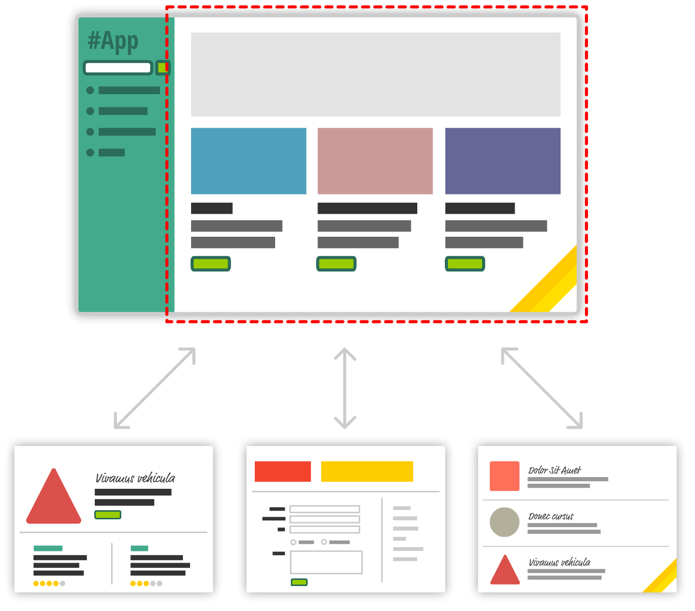
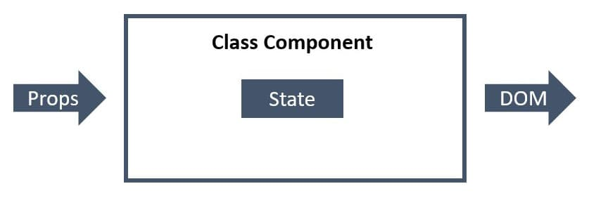
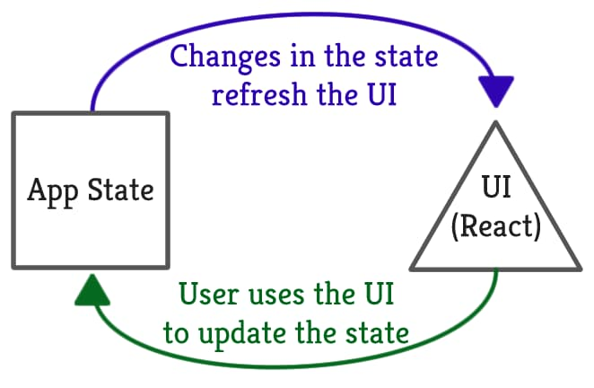
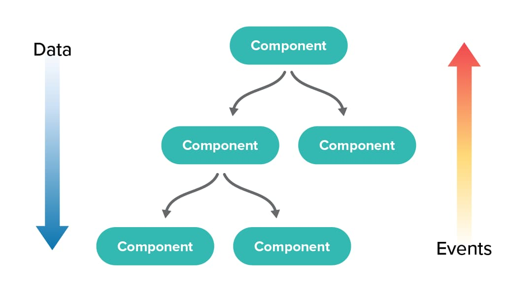
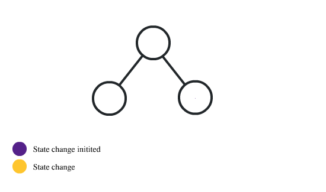
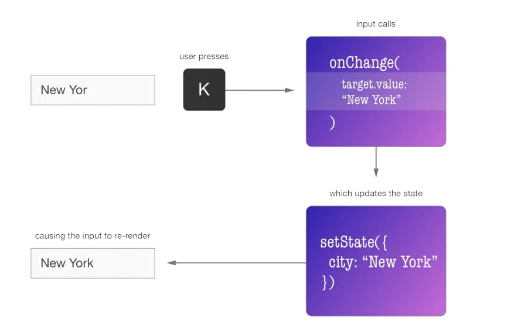
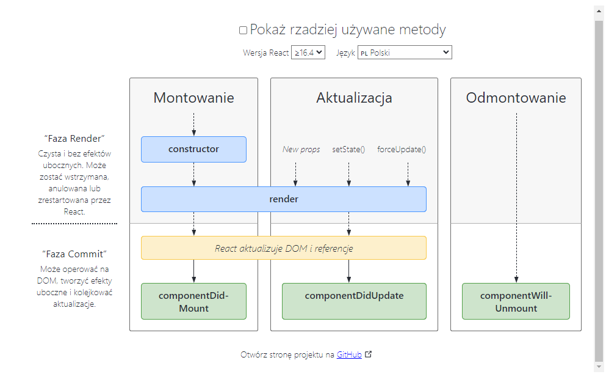
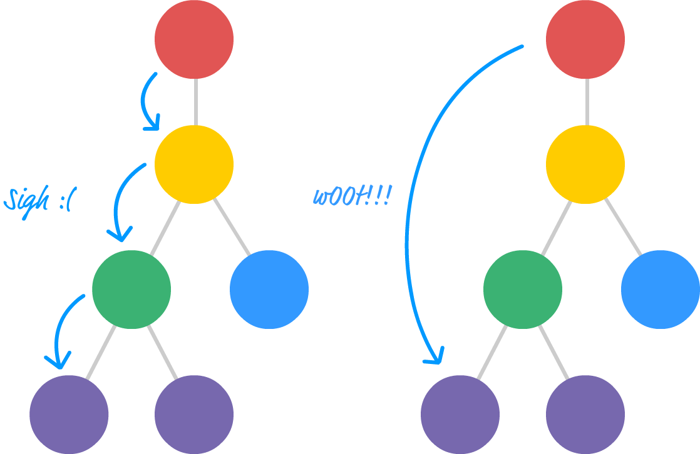
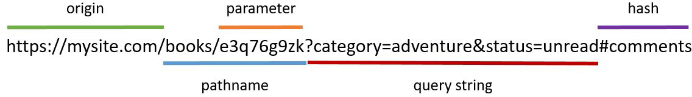

- [Single-Page Application](#single-page-application)
- [Renderowanie warunkowe przy pomocy operatora logicznego \&\&](#renderowanie-warunkowe-przy-pomocy-operatora-logicznego-)
- [:bulb: wazne](#bulb-wazne)
- [Renderowanie warunkowe przy pomocy conditional ternary operator ( ? : )](#renderowanie-warunkowe-przy-pomocy-conditional-ternary-operator----)
- [Style wbudowane](#style-wbudowane)
- [:bulb: WAZNE](#bulb-wazne-1)
- [Vanilla CSS](#vanilla-css)
- [Tworzenie klas CSS](#tworzenie-klas-css)
- [Normalizacja stylu](#normalizacja-stylu)
- [Komponenty klasy](#komponenty-klasy)
- [Zdarzenia](#zdarzenia)
- [Licznik](#licznik)
- [Funkcje obsługi zdarzeń](#funkcje-obsługi-zdarzeń)
- [Powiązanie this](#powiązanie-this)
- [Powiązanie w trakcie przekazywania callbacku](#powiązanie-w-trakcie-przekazywania-callbacku)
- [Powiązanie w konstruktorze](#powiązanie-w-konstruktorze)
- [Publiczne właściwości klasy](#publiczne-właściwości-klasy)
- [Wewnętrzny stan komponentu](#wewnętrzny-stan-komponentu)
- [Stan początkowy w zależności od props](#stan-początkowy-w-zależności-od-props)
- [Zmiana stanu komponentu](#zmiana-stanu-komponentu)
- [Jak aktualizuje się stan](#jak-aktualizuje-się-stan)
- [Asynchroniczność aktualizacji stanu](#asynchroniczność-aktualizacji-stanu)
- [setState z funkcją](#setstate-z-funkcją)
- [Zmiana stanu rodzica](#zmiana-stanu-rodzica)
- [Typy wewnętrznych danych komponentu-klasy](#typy-wewnętrznych-danych-komponentu-klasy)
- [Formularze](#formularze)
  - [Niekontrolowane elementy](#niekontrolowane-elementy)
- [Kontrolowane elementy](#kontrolowane-elementy)
- [Skomplikowane formularze](#skomplikowane-formularze)
- [Generowanie identyfikatorów dla elementów formularza](#generowanie-identyfikatorów-dla-elementów-formularza)
- [Pola wyboru typu tak/nie (checkbox)](#pola-wyboru-typu-taknie-checkbox)
- [Pole wielu opcji (radio)](#pole-wielu-opcji-radio)
- [Pola wyboru (Select)](#pola-wyboru-select)
- [Cykl życiowy](#cykl-życiowy)
- [Etap montowania](#etap-montowania)
- [constructor](#constructor)
- [getDerivedStateFromProps](#getderivedstatefromprops)
- [Render](#render)
- [componentDidMount](#componentdidmount)
- [Etap aktualizacji](#etap-aktualizacji)
- [Etap odmontowywania](#etap-odmontowywania)
- [Obsługa błędów renderowania](#obsługa-błędów-renderowania)
- [React **Hooks**](#react-hooks)
- [Hook useState](#hook-usestate)
- [Różnice względem setState](#różnice-względem-setstate)
- [Ograniczenia hooków](#ograniczenia-hooków)
- [Hook useEffect](#hook-useeffect)
- [Analogia do componentDidMount](#analogia-do-componentdidmount)
- [Analogia do componentDidUpdate](#analogia-do-componentdidupdate)
- [Lista zależności](#lista-zależności)
- [Analogia do componentWillUnmount](#analogia-do-componentwillunmount)
- [Kilka efektów](#kilka-efektów)
- [Własne hooki](#własne-hooki)
- [Hook useToggle](#hook-usetoggle)
- [Hook useFormValue](#hook-useformvalue)
- [Kontekst i useContext](#kontekst-i-usecontext)
- [Funkcja createContext()](#funkcja-createcontext)
- [Komponent ```<Provider>```](#komponent-provider)
- [Hook useContext()](#hook-usecontext)
- [Customowy hook kontekstu](#customowy-hook-kontekstu)
- [Kontekst użytkownika](#kontekst-użytkownika)
- [Customowy komponent providera](#customowy-komponent-providera)
- [Hook useMemo](#hook-usememo)
- [Hook useRef](#hook-useref)
- [Tworzenie](#tworzenie)
- [Cykl życiowy refa](#cykl-życiowy-refa)
- [Brak reaktywności](#brak-reaktywności)
- [Prosty odtwarzacz video](#prosty-odtwarzacz-video)
- [Przekierowanie refów](#przekierowanie-refów)
- [Routing](#routing)
- [Struktura łańcucha URL](#struktura-łańcucha-url)
- [Routing w React](#routing-w-react)
- [Komponent BrowserRouter](#komponent-browserrouter)
- [Komponenty Route i Routes](#komponenty-route-i-routes)
- [Strona błędu nawigacji](#strona-błędu-nawigacji)
- [Komponenty Link и NavLink](#komponenty-link-и-navlink)
- [Parametry URL](#parametry-url)
- [Hook useParams](#hook-useparams)
- [Zagnieżdżone ścieżki](#zagnieżdżone-ścieżki)
- [Ścieżki indeksowe](#ścieżki-indeksowe)


# Single-Page Application

Współczesne podejście zakłada tworzenie stron dynamicznych, na których użytkownik nigdy nie przechodzi na inne strony HTML. Interfejs, zamiast otrzymywać kolejne dokumenty HTML z serwera, dynamicznie zmienia się w przeglądarce. Odbywa się to na tej samej stronie, bez ponownego ładowania dokumentu.





:bulb: Single-page application (SPA) wyróżnia:

     
- Architektura klient-serwer  
- Podczas pierwszego ładowania strony serwer zawsze zwraca stronę startową - dokument index.html
- Każde kolejne zapytanie do serwera wykonuje się jedynie celem wymiany danych w formacie JSON
- Aktualizacja interfejsu odbywa się dynamicznie w kliencie (w przeglądarce)
- Pierwsze załadowanie strony może być dość wolne (dlatego, że zawiera ona cały interfejs)
- Logika niezwiązana z bezpieczeństwem znajduje się w kliencie
- Gorsze SEO, w porównaniu do MPA (można to jednak naprawić)
- Lepsza skalowalność i utrzymywalność kodu

---

# Renderowanie warunkowe przy pomocy operatora logicznego &&


# :bulb: wazne

>children to jest to co definujemy miedzy nawiasami!!

---

Czyta się jako: jeśli warunek sprowadza się do true, wyrenderuj wszystko na prawo od operatora.

```JS
const Mailbox = ({ unreadMessages }) => {
  return (
    <div>
      <h1>Hello!</h1>
      {unreadMessages.length > 0 && (
        <p>You have {unreadMessages.length} unread messages.</p>
      )}
    </div>
  );
};
```

# Renderowanie warunkowe przy pomocy conditional ternary operator ( ? : )

Czyta się jako: jeśli warunek sprowadza sie do true, wyrenderuj wszystko po ?, w przeciwnym razie wyrenderuj przekazaną wartość po : .

```JS
const Mailbox = ({ username, unreadMessages }) => {
  return (
    <div>
      <h1>Hello {username}</h1>
      {unreadMessages.length > 0 ? (
        <p>You have {unreadMessages.length} unread messages.</p>
      ) : (
        <p>No unread messages.</p>
      )}
    </div>
  );
};
```

Ostatni przykład można zapisać inaczej, rezultat będzie taki sam.

```JS
const Mailbox = ({ name, unreadMessages }) => {
  return (
    <div>
      <h1>Hello {name}</h1>
      <p>
        {unreadMessages.length > 0
          ? `You have ${unreadMessages.length} unread messages.`
          : "No unread messages."}
      </p>
    </div>
  );
};
```


---

# Style wbudowane

Istnieje kilka sposobów stylowania komponentów, z których najprostszym (ale jednocześnie najbardziej ograniczonym) są style wbudowane. W tym celu używany jest atrybut HTML style, który w składni JSX React przyjmuje obiekt styli (w przeciwieństwie do oryginalnej składni HTML, która oczekuje łańcucha znaków).

# :bulb: WAZNE
>zamaist myslinkow jak w css uwywa sie cammelCase  
background-color: red;        <---- css  
 backgroundColor: "gray",     <---- wbudowany styl
```JS
const App = () => {
  return (
    <p
      style={{
        margin: 8,
        padding: "12px 16px",
        borderRadius: 4,  // wartosc liczbowa domyslnie jest w px
        backgroundColor: "gray",
        color: "white",
      }}
    >
      Please update your email!
    </p>
  );
};
```

Na podstawie powyższego przykładu możemy wyróżnić kilka reguł dla obiektu style:

- Nazwy właściwości składające się z dwóch lub więcej słów, takie jak background-color, muszą być zapisane w notacji camelCase (backgroundColor). Analogicznie jak w przypadku odwoływania się do właściwości obiektu style elementu DOM.
- Przyrostek px zostanie automatycznie dodany do wartości liczbowych większości właściwości. Jeśli konieczne jest użycie jednostek innych niż px lub jeśli wartość składa się z wielu części, może być ona określona jako łańcuch znaków.

Przenieśmy obiekt style do zmiennej, aby poprawić czytelność znaczników JSX.

```JS
const alertStyles = {
  margin: 8,
  padding: "12px 16px",
  borderRadius: 4,
  backgroundColor: "gray",
  color: "white",
};

const App = () => {
  return (
    <>
      <p style={alertStyles}>Please update your email!</p>
      <p style={alertStyles}>There was an error during transaction!</p>
      <p style={alertStyles}>Payment received, thank you for your purchase!</p>
    </>
  );
};
```

Na podstawie powyższego przykładu możemy wyróżnić kilka reguł dla obiektu style:

- Nazwy właściwości składające się z dwóch lub więcej słów, takie jak background-color, muszą być zapisane w notacji camelCase (backgroundColor). Analogicznie jak w przypadku odwoływania się do właściwości obiektu style elementu DOM.
- Przyrostek px zostanie automatycznie dodany do wartości liczbowych większości właściwości. Jeśli konieczne jest użycie jednostek innych niż px lub jeśli wartość składa się z wielu części, może być ona określona jako łańcuch znaków.

 >Przenieśmy obiekt style do zmiennej, aby poprawić czytelność znaczników JSX.

 ```JS
 const alertStyles = {
  margin: 8,
  padding: "12px 16px",
  borderRadius: 4,
  backgroundColor: "gray",
  color: "white",
};

const App = () => {
  return (
    <>
      <p style={alertStyles}>Please update your email!</p>
      <p style={alertStyles}>There was an error during transaction!</p>
      <p style={alertStyles}>Payment received, thank you for your purchase!</p>
    </>
  );
};
```

Style inline mogą wydawać się wygodne ze względu na łatwość ich użycia, ale mają wiele istotnych wad.

- Bardzo słaba skalowalność i ponowne wykorzystanie styli w innych miejscach aplikacji
- Ograniczone funkcje (pseudoklasy, pseudoelementy, właściwości adaptacyjne)
- Kiepska wydajność podczas renderowania dużej liczby elementów
- Brak wygodnych narzędzi programistycznych ułatwiających pracę ze stylami
- Brak wsparcia popularnych narzędzi, takich jak autoprefixer
- 

>Wnioski   
>
>W praktyce style wbudowane są używane tylko dla wartości właściwości CSS obliczanych dynamicznie, w połączeniu z zewnętrznymi arkuszami stylów. Nie są one jednak zalecane i dlatego nie powinny być używane w projektach.


# Vanilla CSS

Style komponentu można również umieścić w arkuszu stylów. W tym przypadku style każdego komponentu są deklarowane w osobnym pliku CSS z rozszerzeniem .css. Nazwa pliku powinna się składać z nazwy komponentu i rozszerzenia. Na przykład dla komponentu Alert arkusz stylów miałby nazwę Alert.css.

```css
.alert {
  margin: 8px;
  padding: 12px 16px;
  border-radius: 4px;
  background-color: gray;
  color: white;
}
```

# Tworzenie klas CSS

Dodajmy klasy CSS dla każdego typu alertu, aby kontrolować kolor tła na podstawie właściwości variant. Dla wygody nazwijmy poszczególne klasy analogicznie jak nasze zdefiniowane stany właściwości variant.

```css
.alert {
  margin: 8px;
  padding: 12px 16px;
  border-radius: 4px;
  color: white;
}

.alert.info {
  background-color: blue;
}

.alert.success {
  background-color: green;
}

.alert.error {
  background-color: red;
}

.alert.warning {
  background-color: orange;
}
```

Dodajmy jeszcze dwie opcjonalne właściwości (props) outlined i elevated do komponentu Alert. Wartości jakie będą one przyjmować to true, false lub undefined. Jeśli wartość właściwości będzie równa true dodamy odpowiednie klasy is-outlined i is-elevated do elementu <p>.

```css
/* Cały poprzedni kod CSS */

.alert.is-outlined {
  outline: 1px solid black;
}

.alert.is-elevated {
  box-shadow: rgb(0 0 0 / 20%) 0px 3px 3px -2px, rgb(0 0 0 / 14%) 0px 3px 4px 0px,
    rgb(0 0 0 / 12%) 0px 1px 8px 0px;
}
```

Proces obliczania końcowej wartości atrybutu className zależy od dewelopera i bieżącego zadania. W poniższym przykładzie używamy tablicy łańcuchów i bloku if. Klasa alert w połaczeniu z wariantem jest zawsze dodana do tablicy. Natomiast klasy dla właściwości elevated i outlined zostaną dodane tylko wtedy, gdy spełniony zostanie odpowiedni warunek.

```js
import "./Alert.css";

const Alert = ({ variant, outlined, elevated, children }) => {
  const classNames = ["alert", variant];

  if (outlined) classNames.push("is-outlined");
  if (elevated) classNames.push("is-elevated");

  return <p className={classNames.join(" ")}>{children}</p>;
};
```
---

>Brak standardu :bulb:
>
>Aby obliczyć ostateczną wartość atrybutu className, moglibyśmy użyć bloku if...else, instrukcji switch, operatora warunkowego lub innej składni JavaScript dającej analogiczny wynik. Najważniejsze jest to, aby ostateczna wartość atrybutu była poprawnie skomponowana i nie zawierała dodatkowych, lub nieprawidłowych wartości.

# Normalizacja stylu

Style elementów mogą się różnić w zależności od przeglądarki. Aby nadać im jednakowy wygląd, konieczne może być dodanie zestawu reguł, które w jak największym stopniu korygują te różnice.

W aplikację Create React App wbudowane jest narzędzie PostCSS Normalize, będące mieszanką najlepszych praktyk normalizacji (normalize.css oraz sanitize.css). Wszystko co musisz zrobić to dodać dyrektywę @import-normalize; w dowolnym miejscu arkusza styli lub module CSS. Zduplikowane importy zostaną automatycznie usunięte, więc dyrektywę wystarczy dodać raz, np. do index.css.

```css 
@import-normalize;

/* Pozostały kod CSS */
```

>:bulb:Ustawienia VSCode
>
>Jeśli zobaczysz ostrzeżenie «Unknown at rule @import-normalize css(unknownAtRules)» w VSCode, to zmień wartość parametru 'css.lint.unknownAtRules' w ustawieniach na 'ignore'.

Pozostaje teraz tylko zaimportować plik styli index.css (z włączoną normalizacją) w dowolnym miejscu naszej aplikacji.

```css
import "./index.css";

/* Reszta kodu z pliku */
```

Oprócz standaryzacji wyglądu elementów, przydatne może być również zresetowanie lub dodanie globalnych styli elementów. Na przykład wcięcia list i nagłówków, style obrazów, style elementów <body> i tym podobne. Logiczne będzie zrobienie tego w tym samym pliku, w którym dodano normalizację.

```css
@import-normalize;

body {
  font-family: sans-serif;
  line-height: 1.5;
}

h1,
h2,
h3,
h4,
h5,
h6,
p {
  margin: 0;
}

ul,
ol {
  margin: 0;
  padding: 0;
}

img {
  display: block;
  max-width: 100%;
  height: auto;
}
```

# Komponenty klasy

Komponenty tworzymy jako klasy, kiedy niezbędne jest dodanie do nich dynamiki. Dotychczas komponenty funkcyjne były ograniczone możliwościami tylko do otrzymywania propsów. Nie jest to już prawda, odkąd w React udostępnione zostały hooki (od wersji React 16.8), natomiast zostanie to omówione w późniejszych rozdziałach.



- Zwykła klasa ES6, dlatego stosujemy wymaganą składnię JavaScript: konstruktor, metody, kontekst (this).
- Obowiązkowo rozszerza klasę podstawową React.Component.
- Działa jak funkcja, która otrzymuje props, ale dostęp do właściwości odbywa się z użyciem kontekstu (this.props).
- Należy zadeklarować obowiązkową metodę render(), która zwraca elementy JSX. Zostanie ona wywołana automatycznie przez Reacta.
- Użycie komponentu klasy spowoduje, że React za każdym będzie tworzył nowy egzemplarz komponentu (klasy). Dlatego dostęp do propsów przebiega przez this.props.
- Można określić niestandardowe metody klasy i wykorzystać je w dowolnym miejscu, w tym również wewnątrz JSX.
- Zmiana stanu komponentu lub jego propsów spowoduje ponowne renderowanie ("re-render").

```JS
// Używaj importów nazwanych zamiast składni `React.Component`, zwiększa to czytelność kodu
import React, { Component } from "react";

class MyClassComponent extends Component {
  static defaultProps = {};

  static propTypes = {};

  render() {
    return <div>Class Component</div>;
  }
}
```


# Zdarzenia

Dla natywnego zdarzenia przeglądarki React posiada obiekt-opakowanie SyntheticEvent Object z identycznym interfejsem. Jest to niezbędne, aby zapewnić kompatybilność z różnymi przeglądarkami i zoptymalizować wydajność.

```JS
<button onClick={event => console.log(event)}>Click me!</button>
```

- Obsługa zdarzeń z wykorzystaniem EventTarget.addEventListener() praktycznie nie jest niewykorzystywana (poza kilkoma wyjątkami).
- Propsy zdarzeń nie są wyjątkiem i nazywane są w notacji camelCase, np. onClick, onChange, onSubmit, onMouseEnter.
- Do propsu zdarzenia przekazujemy referencję do funkcji (callback), która zostanie wywołana w przypadku wystąpienia danego zdarzenia.
- Funkcje obsługi zdarzeń otrzymują egzemplarz SyntheticEvent Object.
- 
W React "pod maską" realizowane jest delegowanie zdarzeń. "Listenery" nie są dodawane bezpośrednio do elementów DOM. Przekazanie callback'a to po prostu rejestracja funkcji, która będzie wywołana przez wewnętrzne mechanizmy React'a w przypadku wystąpienia zdarzenia.

# Licznik

Stwórzmy komponent-licznik, który docelowo będzie miał możliwość zwiększania i zmniejszania wartości.


```JS
import React, { Component } from "react";
import ReactDOM from "react-dom";

class Counter extends Component {
  static defaultProps = {
    step: 1,
  };

  render() {
    const { step } = this.props;

    return (
      <div>
        <span>0</span>
        <button type="button">Increment by {step}</button>
        <button type="button">Decrement by {step}</button>
      </div>
    );
  }
}

ReactDOM.render(<Counter step={5} />, document.getElementById("root"));
```


# Funkcje obsługi zdarzeń

Najczęściej funkcje obsługi zdarzeń deklaruje się jak metody klasy, a następnie do atrybutu JSX przekazywana jest referencja do danej metody.

```JS
class Counter extends Component {
/* ... */

  handleIncrement(evt) {
    console.log("Increment button was clicked!", evt);// działa
    console.log("this.props: ", this.props);// Error: cannot read props of undefined
  }

  handleDecrement(evt) {
    console.log("Decrement button was clicked!", evt);// działa
    console.log("this.props: ", this.props);// Error: cannot read props of undefined
  }

  render() {
    const { step } = this.props;

    return (
      <div>
        <span>0</span>
        <button type="button" onClick={this.handleIncrement}>
          Increment by {step}
        </button>
        <button type="button" onClick={this.handleDecrement}>
          Decrement by {step}
        </button>
      </div>
    );
  }
}
```

# Powiązanie this

Należy zawsze pamiętać o wartości this w metodach wykorzystywanych jako funkcje callback. W JavaScripcie kontekst w metodach klasy nie przywiązuje się domyślnie. Jeśli zapomni się o powiązaniu kontekstu to w czasie wywołania funkcji (w ramach obsługi zdarzenia) this pozostanie nieokreślony.

# Powiązanie w trakcie przekazywania callbacku

Unikaj powiązywania kontekstu w metodzie render(). Za każdym razem, gdy komponent renderuje się ponownie, Function.prototype.bind() zwraca nową funkcję i przekazuje ją w dół drzewa komponentów. Pprowadzi do powtórnego renderowania komponentów dzieci. Może to mieć istotny wpływ na wydajność.

```JS 
// ❌ Źle
class Counter extends Component {
/* ... */

  handleIncrement(evt) {
// ...
  }

  handleDecrement(evt) {
// ...
  }

  render() {
    const { step } = this.props;

    return (
      <div>
        <span>0</span>
        <button type="button" onClick={this.handleIncrement.bind(this)}>
          Increment by {step}
        </button>
        <button type="button" onClick={this.handleDecrement.bind(this)}>
          Decrement by {step}
        </button>
      </div>
    );
  }
}
```

# Powiązanie w konstruktorze

Kontekst można również powiązać w konstruktorze klasy. Jednak można sobie wyobrazić, o ile zwiększy się otrzymamy konstruktor, jeśli funkcji będzie wiele.

-  Konstruktor wykonuje się jeden raz, dlatego bind również zostanie wywołane tylko jeden raz.
-  Metody klasy zapisywane są we właściwości prototype funkcji-konstruktora.


```JS
// ✅ Nieźle
class Counter extends Component {
/* ... */

  constructor() {
    super();
    this.handleIncrement = this.handleIncrement.bind(this);
    this.handleDecrement = this.handleDecrement.bind(this);
  }

  handleIncrement(evt) {
// ...
  }

  handleDecrement(evt) {
// ...
  }

  render() {
    const { step } = this.props;

    return (
      <div>
        <span>0</span>
        <button type="button" onClick={this.handleIncrement}>
          Increment by {step}
        </button>
        <button type="button" onClick={this.handleDecrement}>
          Decrement by {step}
        </button>
      </div>
    );
  }
}
```

# Publiczne właściwości klasy
Rekomendowany sposób przywiązania kontekstu to składnia publicznych pól klasy. Po wywołaniu publicznych pól klasy, zapisują się one nie we właściwości prototype funkcji-konstruktora, a w obiekcie egzemplarza klasy.

```JS
// ✅ Super
class Counter extends Component {
/* ... */

  handleIncrement = evt => {
    console.log("Increment button was clicked!", evt);// działa
    console.log("this.props: ", this.props);// działa
  };

  handleDecrement = evt => {
    console.log("Decrement button was clicked!", evt);// działa
    console.log("this.props: ", this.props);// działa
  };

  render() {
    const { step } = this.props;

    return (
      <div>
        <span>0</span>
        <button type="button" onClick={this.handleIncrement}>
          Increment by {step}
        </button>
        <button type="button" onClick={this.handleDecrement}>
          Decrement by {step}
        </button>
      </div>
    );
  }
}
```

# Wewnętrzny stan komponentu

Stan komponentu (state) pozwala nam dynamicznie aktualizować interfejs użytkownika w odpowiedzi na jego działania. Za każdym razem, gdy zmienia się stan komponentu (lub propsy), wywoływana jest metoda render(). W stanie powinniśmy przechowywać jedynie minimalny, niezbędny zestaw danych, potrzebny do prawidłowego zaktualizowania interfejsu użytkownika.



Stan należy do komponentu klasowego i można go zmienić tylko za pomocą metod zdefiniowanych w obrębie klasy. Zmiana stanu komponentu nigdy nie aktualizuje jego rodzica i sąsiadów. Aktualizacji podlegają natomiast wszystkie elementy dzieci danego komponentu. W takim modelu dane w aplikacji przekazują się tylko w jeden konkretny sposób nazywany jednokierunkowym przepływem danych (one way data flow).v



Stan deklaruje się w konstruktorze, ze względu na to, że jest on wywoływany jako pierwszy podczas tworzenia egzemplarza klasy.

```JS
class Counter extends Component {
  constructor() {
    super();

    this.state = {
      value: 0,
    };
  }

/* ... */

  render() {
    return (
      <div>
        <span>{this.state.value}</span>
        {/* ... */}
      </div>
    );
  }
}
```

# Stan początkowy w zależności od props
Czasami konieczne może być aby początkowy stan zależał od przekazanych propsów, np. początkowa wartość naszego licznika. W takim przypadku należy jawnie zadeklarować parametr props w konstruktorze i przekazać go do wywołania super(props). Dopiero wtedy w konstruktorze będzie dostępne this.props.

```JS
class Counter extends Component {
  static defaultProps = {
    step: 1,
    initialValue: 0,
  };

  constructor(props) {
    super(props);

    this.state = {
      value: this.props.initialValue,
    };
  }

/* ... */
}

ReactDOM.render(<Counter initialValue={10} />, document.getElementById("root"));
```

Możemy jednak pominąć męczące deklarowanie konstruktora i zdefiniować stan jako publiczną właściwość klasy. Traspilator (Babel) zajmie się wszystkim za nas.

```JS
class Counter extends Component {
  static defaultProps = {
    step: 1,
    initialValue: 0,
  };

  state = {
    value: this.props.initialValue,
  };

/* ... */
}
```

# Zmiana stanu komponentu
Aktualizacja stanu komponentu odbywa się z wykorzystaniem odziedziczonej metody setState().

```JS
setState(updater, callback);
```

- Jako pierwszy, obowiązkowy argument przekazujemy obiekt z polami wskazującymi, jaką część stanu chcemy zmienić.
- Jako drugi, nieobowiązkowy argument można przekazać funkcję callback, która wykona się po zmianie stanu.

>⚠️ danger
>
>Obiekt stanu state to właściwość klasy, jednak nigdy nie wolno jej zmieniać bezpośrednio.

```JS
state = { fullName: "Poly" };

// ❌ Źle - mutacja stanu
this.state.fullName = "Mango";

// ✅ Dobrze
this.setState({
  fullName: "Mango",
});
```

Stwórzmy komponent z przełącznikiem, którego metody będą nadpisywać wartość isOpen w stanie.

```JS
class Toggle extends Component {
  state = { isOpen: false };

  show = () => this.setState({ isOpen: true });

  hide = () => this.setState({ isOpen: false });

  render() {
    const { isOpen } = this.state;
    const { children } = this.props;

    return (
      <>
        <button onClick={this.show}>Show</button>
        <button onClick={this.hide}>Hide</button>
        {isOpen && children}
      </>
    );
  }
}
```

# Jak aktualizuje się stan
Aktualizując stan przy pomocy setState() nie musimy przekazywać wszystkich właściwości przechowywanych w stanie. Wystarczy przekazać jedynie tą część stanu, którą chcemy zmienić w danym momencie. React sam zadba o poprawną aktualizację stanu biorąc aktualny stan i obiekt, który został przekazany w setState(). Odbywa się to zgodnie ze schematem:


```JS
// stan przed połączeniem
const currentState = { a: 2, b: 3, c: 7, d: 9 };

// obiekt przekazany w setState
const updateSlice = { b: 5, d: 4 };

// nowa wartość this.state po połączeniu
const nextState = { ...currentState, ...updateSlice };// {a: 2, b: 5, c: 7, d: 4}
```

# Asynchroniczność aktualizacji stanu

Tak naprawdę metoda setState() nie zmienia stanu natychmiast. Rejestruje ona asynchronicznną operację aktualizacji stanu, która staje w kolejce aktualizacji. Może się również zdarzyć tak, że kilka aktualizacji zostanie połączonych w jedną, w celu polepszenia wydajności. Ze względu na asynchroniczność aktualizacji, dostęp do this.state w synchronicznym kodzie może zwrócić wartość stanu sprzed aktualizacji.

Wyobraź sobie, że w trakcie zmiany stanu polegasz na jego obecnej wartości. Wykorzystamy pętlę for do stworzenia (rejestracji) kilku operacji zmiany stanu.

```JS
// Zaczynamy z następującym stanem:
state = { value: 0 };

// Rozpocznynamy pętlę i wywołujemy 3 operacje zmiany stanu
for (let i = 0; i < 3; i += 1) {
// Ponieważ to synchroniczny kod i aktualizacja stanu jeszcze nie zaszła
  console.log(this.state.value);

  this.setState({ value: this.state.value + 1 });
}
```

Powyższy fragment kodu zwróci w konsoli wartość 0 dla każdej iteracji pętli.

Wyjaśnienie:

Wartość właściwości this.state.value jest zapamiętywana w czasie tworzenia obiektu przekazywanego do setState(), a nie w czasie aktualizacji stanu. Oznacza to, że jeśli w czasie utworzenia obiektu, this.state.value miało wartość 0, to do funkcji setState() przekazany zostanie obiekt {value: 0 + 1}.

W wyniku wykonania pętli otrzymamy kolejkę aktualizacji z 3 obiektów { value: 0 + 1 }, { value: 0 + 1 }, { value: 0 + 1 } i oryginalny stan w momencie aktualizacji { value: 0 }. Po wszystkich aktualizacjach otrzymamy stan { value: 1 }.

Z tego względu nie można polegać na obecnym stanie podczas obliczania następnego (zależnego od poprzedniego w momencie aktualizacji). Rozwiązaniem tego problemu jest drugi sposób na aktualizację stanu.

# setState z funkcją

Metoda setState() jako pierwszy argument może przyjmować nie tylko obiekt, ale również funkcję. Niemniej, funkcja taka powinna w dalszym ciągu zwrócić obiekt, którym chcemy zaktualizować stan.

```JS
setState((state, props) => {
  return {};
}, callback);
```
Aktualny stan i propsy zostaną przekazane do funkcji na czas jej wykonywania. W ten sposób można być pewnym poprawnej wartości poprzedniego stanu podczas tworzenia następnego.

```JS
state = { value: 0 };

for (let i = 0; i < 3; i += 1) {
  console.log(this.state.value);// 0

  this.setState(prevState => {
    console.log(prevState.value);// zwróci poprawne wartości stanu podczas każdej iteracji

    return { value: prevState.value + 1 };
  });
}
```

Poprawmy zatem komponent przełącznika Toggle.

```JS
class Toggle extends Component {
  state = { isOpen: false };

  toggle = () => {
    this.setState(state => ({ isOpen: !state.isOpen }));
  };

  render() {
    const { isOpen } = this.state;
    const { children } = this.props;

    return (
      <div>
        <button onClick={this.toggle}>{isOpen ? "Hide" : "Show"}</button>
        {isOpen && children}
      </div>
    );
  }
}
```

Natomiast licznik będzie wyglądał następująco:

```JS
class Counter extends Component {
/* ... */

  handleIncrement = () => {
    this.setState((state, props) => ({
      value: state.value + props.step,
    }));
  };

  handleDecrement = () => {
    this.setState((state, props) => ({
      value: state.value - props.step,
    }));
  };

/* ... */
}

```

# Zmiana stanu rodzica

React wykorzystuje jednokierunkowy przepływ danych, dlatego aby zmienić stan rodzica podczas zdarzenia w komponencie dziecku wykorzystuje się wzorzec z funkcją callback.



- W rodzicu zdefiniowany jest stan i metoda, która go zmienia.
- Do dziecka przerzuca się, za pomocą props, metodę rodzica zmieniającą stan rodzica.
- W dziecku zachodzi wywołanie przekazanej do niego metody.
- Wywołaniu tej metody zmienia stan rodzica.
- Zachodzi ponowne renderowanie poddrzewa komponentów rodzica.

Spójrzmy na prosty, ale obrazowy przykła

```js
// Przycisk otrzyma funkcję changeMessage (nazwa właściwości props),
// która zostanie wywołana podczas zdarzenia onClick
const Button = ({ changeMessage, label }) => (
  <button type="button" onClick={changeMessage}>
    {label}
  </button>
);

class App extends Component {
  state = {
    message: new Date().toLocaleTimeString(),
  };

// Metoda, którą będziemy przekazywać do przycisku
  updateMessage = evt => {
    console.log(evt);// Dostępny obiekt zdarzenia w odwołaniu onClick

    this.setState({
      message: new Date().toLocaleTimeString(),
    });
  };

  render() {
    return (
      <>
        <span>{this.state.message}</span>
        <Button label="Change message" changeMessage={this.updateMessage} />
      </>
    );
  }
}
```

Stan komponentu App jest aktualizowany przy pomocy funkcji updateMessage, której wywołanie następuje po kliknięciu w przycisk. Wzorzec ten ustanawia wyraźną granicę pomiędzy "mądrymi" (smart) i "głupimi" (dumb) komponentami.

Metodę do aktualizacji stanu rodzica możemy przekazywać poprzez props dowolną ilość razy w głąb drzewa komponentów.


# Typy wewnętrznych danych komponentu-klasy

- static data - statyczne właściwości i metody klasy
- this.state.data - dane dynamiczne, poddawane aktualizacji z pomocą metod komponentu-klasy
- this.data - dane, które będą inne dla każdej instancji klasy.
- const DATA - stałe, które nie zmieniają się i są jednakowe dla wszystkich instancji.


# Formularze

## Niekontrolowane elementy

Podstawowym celem każdego formularza jest zebranie danych od użytkownika. Do tego celu możemy wykorzystać właściwość elements elementu formualrza (form) dostępną podczas obsługi jego wysyłania. Alternatywnie możemy wykorzystać interfejs FormData.

```js
class LoginForm extends Component {
  handleSubmit = evt => {
    evt.preventDefault();

    const form = evt.currentTarget;
    const login = form.elements.login.value;
    const password = form.elements.password.value;

    console.log(login, password);

    this.props.onSubmit({ login, password });

    form.reset();
  };

  render() {
    return (
      <form onSubmit={this.handleSubmit}>
        <input type="text" name="login" />
        <input type="password" name="password" />
        <button type="submit">Login</button>
      </form>
    );
  }
}

ReactDOM.render(
  <LoginForm onSubmit={values => console.log(values)} />,
  document.getElementById("root")
);
```

Dostęp do danych w takiej formie jest właściwy, gdy dane pól formularza potrzebne są nam tylko w czasie jego wysyłania ('submit').

# Kontrolowane elementy

Dane pól formularza mogą nam być również potrzebne w innych komponentach albo w momencie zmiany pola. W takiej sytuacji elementy formularza powinny być kontrolowane. Najprościej mówiąć, oznacza to, że wartości wszystkich pól powinny znajdować się w stanie.



- Pole w state określa wartość atrybutu value danego elementu formularza.
- Zdarzeniu onChange przekazuje się metodę zmieniającą wartość pola w stanie.

Otrzymujemy obwód zamknięty:

- Po zdarzeniu onChange, metoda klasy aktualizuje pole w stanie.
- Po zmianie stanu zachodzi re-render.
- Input otrzymuje zaktualizowaną wartość.

Wadą takiego rozwiązania jest to, że cały formularz zostanie przerenderowany po każdej zmianie któregokolwiek z pól. Dla małych formularzy nie stanowi to jednak problem- 

```js
class App extends Component {
  state = {
    inputValue: "",
  };

  handleChange = evt => {
    this.setState({ inputValue: evt.target.value });
  };

  render() {
    const { inputValue } = this.state;
    return (
      <input type="text" value={inputValue} onChange={this.handleChange} />
    );
  }
}
```

Zachodzi tutaj taka prawidłowość, że to nie interfejs określa, jakie mamy dane. Przeciwnie, to dane określają to, co widzi użytkownik, aktualizując DOM po zmianie stanu komponentu.

# Skomplikowane formularze

Utworzymy teraz formularz rejestracji.

```js
class SignUpForm extends Component {
  state = {
    login: "",
  };

// Odpowiada za aktualizację stanu
  handleChange = e => {
    this.setState({ login: e.target.value });
  };

// Wywoływany jest podczas wysyłania formularza
  handleSubmit = evt => {
    evt.preventDefault();
    console.log(`Signed up as: ${this.state.login}`);

// Props, który przekazywany jest do formularza do wywołania podczas jego wysyłania
    this.props.onSubmit({ ...this.state });
  };

  render() {
    const { login } = this.state;

    return (
      <form onSubmit={this.handleSubmit}>
        <label>
          Name
          <input
            type="text"
            placeholder="Enter login"
            value={login}
            onChange={this.handleChange}
          />
        </label>

        <button type="submit">Sign up as {login}</button>
      </form>
    );
  }
}

ReactDOM.render(
  <SignUpForm onSubmit={values => console.log(values)} />,
  document.getElementById("root")
);
```

Dodajemy jeszcze pola dla email oraz password. W tym celu wykorzystamy bardzo przydatny wzorzec aktualizacji stanu wielu pól z użyciem jednej metody.

```js
// Dla poprawy czytelności kodu można przenieść stan początkowy formularza poza ciało klasy.
// Możemy tak zrobić, jeżeli wartości nie są obliczane dynamicznie.
const INITIAL_STATE = {
  login: "",
  email: "",
  password: "",
};

class SignUpForm extends React.Component {
  state = { ...INITIAL_STATE };

// Dla wszystkich elementów wykorzystamy jedną funkcję obsługującą zmianę stanu ('handler').
// Inputy będziemy rozróżniać za pomocą atrybutu `name`
  handleChange = evt => {
    const { name, value } = evt.target;
    this.setState({ [name]: value });
  };

  handleSubmit = evt => {
    evt.preventDefault();
    const { login, email, password } = this.state;

    console.log(`Login: ${login}, Email: ${email}, Password: ${password}`);

    this.props.onSubmit({ ...this.state });
    this.reset();
  };

  reset = () => {
    this.setState({ ...INITIAL_STATE });
  };

  render() {
    const { login, email, password } = this.state;

    return (
      <form onSubmit={this.handleSubmit}>
        <label>
          Name
          <input
            type="text"
            placeholder="Enter login"
            name="login"
            value={login}
            onChange={this.handleChange}
          />
        </label>
        <label>
          Email
          <input
            type="email"
            placeholder="Enter email"
            name="email"
            value={email}
            onChange={this.handleChange}
          />
        </label>
        <label>
          Password
          <input
            type="password"
            placeholder="Enter password"
            name="password"
            value={password}
            onChange={this.handleChange}
          />
        </label>

        <button type="submit">Sign up as {login}</button>
      </form>
    );
  }
}
```

# Generowanie identyfikatorów dla elementów formularza

**Dostępność (accessibility, a11y)** to obecnie bardzo ważny temat w sieci. Atrybut HTML for dla tagu label pomaga technologiom wspomagającym użytkowników lepiej zrozumieć i odczytać interfejs formularza. Jako, że for to słowo kluczowe w JavaScript, w React JSX atrybut nosi nazwę htmlFor.

Do generowania interaktywnych elementów formularzy wykorzystywane jest następujące podejście: dla każdego egzemplarza komponentu, przy jego inicjalizacji, tworzony jest zestaw unikalnych identyfikatorów przechowywanych na egzemplarzu. W ten sposób między różnymi formularzami uzyskamy unikalne id.

```js
// Możemy wykorzystać dowolną bibliotekę do generowania unikalnych łańcuchów
import { nanoid } from "nanoid";

class Form extends React.Component {
  loginInputId = nanoid();

  render() {
    return (
      <form>
        <label htmlFor={this.loginInputId}>Login</label>
        <input type="text" name="login" id={this.loginInputId} />
      </form>
    );
  }
}
```

Wykorzystując bibliotekę nanoid tworzymy unikalny identyfikator pola i zapisujemy go w polu klasy. Wartość zostanie wygenerowana podczas inicjalizacji klasy, i dzięki wykorzystaniu pola klasy, nie ulegnie zmianie podczas re-renderów komponentu. Biblioteka zagwarantuje nam unikalność identyfikatorów dla wszystkich elementów, również pomiędzy wieloma formularzami.

# Pola wyboru typu tak/nie (checkbox)

Cechy charakterystyczne pól wyboru:

- Może mieć tylko dwa stany: true lub false.
- Aktualną wartość ze stanu przekazujemy do pola checked.
- Podczas obsługi zdarzenia onChange dostęp do wartości pola udostępniony jest poprzez event.target.checked.
- Jeżeli chcemy, aby przycisk wyboru przechowywał inną wartość niż logiczną, możemy również wykorzystać atrybut value.

Dodajmy do naszego formularza rejestracji pole wyboru do potwierdzenia zgody użytkownika. Przycisk wysyłania furmularza ('submit') dezaktywujemy, dopóki pole wyboru nie zostanie kliknięt- 

```js
const INITIAL_STATE = {
  login: "",
  email: "",
  password: "",
  agreed: false,
};

class SignUpForm extends React.Component {
  state = {
    ...INITIAL_STATE,
  };

  handleChange = evt => {
    const { name, value, type, checked } = evt.target;
// Jeżeli typ elementu to checkbox, bierzemy wartość checked,
// w przeciwnym razie value
    this.setState({ [name]: type === "checkbox" ? checked : value });
  };

  handleSubmit = e => {
    e.preventDefault();
    const { login, email, password, agreed } = this.state;
    console.log(
      `Login: ${login}, Email: ${email}, Password: ${password}, Agreed: ${agreed}`
    );

/* ... */
  };

  render() {
    const { login, email, password, agreed } = this.state;

    return (
      <form onSubmit={this.handleSubmit}>
        {/* ... */}
        <label>
          Agree to terms
          <input
            type="checkbox"
            checked={agreed}
            onChange={this.handleChange}
          />
        </label>

        <button type="submit" disabled={!agreed}>
          Sign up as {login}
        </button>
      </form>
    );
  }
}
````

# Pole wielu opcji (radio)

Pole typu radio posiada zarówno atrybut name (określający przypisaną wartość pola), jak również checked (określający, czy dana wartość została wybrana).

```js
<input
  type="radio"
  checked={this.state.gender === "male"}
  value="male"
  onChage={this.handleGenderChange}
/>
```

Dodajmy grupę przycisków opcji do naszego formularza.

```js
// Wykorzystujemy obiekt konfiguracyjny (enum) do zdefiniowania dostępnych wartości pola wyboru.
// Jest to postrzegane jako dobry wzorzec, w porównaniu z tzw. "magicznymi łańcuchami" wartości, które biorą się znikąd.
const Gender = {
  MALE: "male",
  FEMALE: "female",
};

const INITIAL_STATE = {
  login: "",
  email: "",
  password: "",
  agreed: false,
  gender: null,
};

class SignUpForm extends React.Component {
  state = {
    ...INITIAL_STATE,
  };

/*... */

  render() {
    const { login, email, password, agreed, gender } = this.state;

    return (
      <form onSubmit={this.handleSubmit}>
        {/* ... */}

        <section>
          <h2>Choose your gender</h2>
          <label>
            Male
            <input
              type="radio"
              checked={gender === Gender.MALE}
              name="gender"
              value={Gender.MALE}
              onChange={this.handleChange}
            />
          </label>
          <label>
            Female
            <input
              type="radio"
              checked={gender === Gender.FEMALE}
              name="gender"
              value={Gender.FEMALE}
              onChange={this.handleChange}
            />
          </label>
        </section>

        <button type="submit" disabled={!agreed}>
          Sign up as {login}
        </button>
      </form>
    );
  }
}
```

# Pola wyboru (Select)

Obsługa pola wyboru typu select jest analogiczna. Wykorzystujemy atrybut value oraz zdarzenie onChange.

```js
const INITIAL_STATE = {
  login: "",
  email: "",
  password: "",
  agreed: false,
  gender: null,
  age: "",
};

class SignUpForm extends React.Component {
  state = {
    ...INITIAL_STATE,
  };

/* ... */

  render() {
    const { login, email, password, agreed, gender, age } = this.state;

    return (
      <form onSubmit={this.handleSubmit}>
        {/* ... */}

        <label>
          Choose your age
          <select name="age" value={age} onChange={this.handleChange}>
            <option value="" disabled>
              ...
            </option>
            <option value="18-25">18-25</option>
            <option value="26-35">26-35</option>
            <option value="36+">36+</option>
          </select>
        </label>

        <button type="submit" disabled={!agreed}>
          Sign up as {login}
        </button>
      </form>
    );
  }
}
```


# Cykl życiowy 

Istnieje kilka stadiów cyklu życia komponentu - montowanie, aktualizacja i odmontowywanie. W czasie każdego z nich w komponencie-klasie wywoływane są metody odziedziczone od React.Component. Możemy przedefiniować ich zachowanie, dodając niezbędną funkcjonalność w ramach określonych zasad.

Istnieje siedem metod cyklu życiowego, pomijając render i constructor. W praktyce, do większości codziennych zadań wykorzystywane są trzy: componentDidMount, componentDidUpdate i componentWillUnmount.



# Etap montowania

Następujące metody wywoływane są po kolei, gdy komponent jest tworzony i dodawany do drzewa DOM.

# constructor

```js
class Alert extends Component {
    constructor() {
        super()
        console.log('Alert constructor!')
    }
}
```

Wywoływany jest w momencie utworzenia egzemplarza komponentu, zanim zostanie on umieszczony w DOM.

- Inicjalizuje stan początkowy komponentu.
- Przywiązuje kontekst (this) w metodach.
- Nie można w nim wywoływać setState().
- W większości przypadków jawne zadeklarowanie konstruktora nie jest potrzebne.
- Należy pamiętać o dodaniu 
- er() ****przed**** wywołaniem jakiekolwiek kodu w konstruktorze - w przeciwnym wypadku otrzymany błąd: Uncaught ReferenceError: **Must call super constructor in derived class before accessing 'this' or returning from derived constructor**

# getDerivedStateFromProps

```js
static getDerivedStateFromProps(nextProps, prevState) {
    return {
        favoriteColor: nextProps.colorList[0] 
    }
}

//props: { colorList: [ 'red', 'blue', 'green' ] }
//state: { favoriteColor: 'red' }
```

- W praktyce metoda ta jest wykorzystywana bardzo rzadko.
- Wywoływana jest przed render(), zarówno podczas montowania jak i aktualizacji.
- Możemy ją wykorzystać do ustawienia stanu w zależności od props podczas każdej ich zmiany.
- Powinna zwrócić obiekt, którym zostanie zaktualizowany stan lub null.
- Brak dostępu do this.
- W większości przypadków da się ją zastąpić używając memoizacji lub pisząc logikę w componentDidUpdate lub render


# Render

```js
// state: { isOpen: false }

render() {
    const { isOpen } = this.state
    const { children} = this.props

    return (
        <div>
            <button onClick={this.show}>Show</button>
            <button onClick={this.hide}>Hide</button>
            <button onClick={this.toggle}>{isOpen ? "Hide" : "Show"}</button>

                        <div>Children list</div>
                        {isOpen && children}
        </div>
    )
}
```

- Pozwala deklaratywnie opisać interfejs.
- Zwraca rezultat wyrażeń JSX, poddrzewo Virtual DOM.
- Nie można w nim wywoływać setState().
- 
# componentDidMount

```js
async componentDidMount() {
    const response = await axios.get('/some-url')
    this.setState({ data: response.data })
}
```

- Wywoływana jest po render() , po zamontowaniu komponentu w drzewie DOM.
- W metodzie tworzymy zapytania HTTP, subskrybujemy się na zdarzenia i wykonujemy operacje na drzewie DOM.
- Wywołanie setState() w tej metodzie spowoduje re-render – to normalne.
- Może być definiowana z przedrostkiem async lub bez niego.

# Etap aktualizacji

Aktualizacja może być wywołana zmianą state samego komponentu lub przekazywanych do niego props. Każda aktualizacja prowadzi to re-renderu komponentu i wywołania poniższych metod cyklu życia.

```js
shouldComponentUpdate(nextProps, nextState) {
    const oldProps = this.props

    if (nextProps.someProp === oldProps.someProp) {
        return false;
    }

    return true;
}

// Re-render komponentu tylko, gdy zostały przekazane nowe propsy
```

- Nie wywołuje się podczas montowania komponentu.
- Wywołuje się tuż przed ponownym renderowaniem już zamontowanego komponentu.
- Wymagana wyłącznie do optymalizacji procesu renderowania.
- Domyślnie render zachodzi za każdym razem przy nowych props lub state. React nie sprawdza dokładnie nowych propsów, to jest czy są różne od poprzednich.
- Pozwala porównać obecny i poprzedni state oraz props.
- Zwrócenie wartości true lub false decyduje o ponownym renderze komponentu lub jego zatrzymaniu.
- Jeśli zwróci false to nie zostanie wywołany render() i componentDidUpdate().
- Domyślnie zwraca true
- Nie można wywoływać setState().
- Należy używać z rozwagą, dopiero po pomiarach wydajności, w przeciwnym razie może spowodować odwrotny efekt.
- Przed użyciem należy wcześniej rozważyć zmianę dziedziczenia na React.PureComponent, który będzie powierzchownie porównywał prop- 


```js
getSnapshotBeforeUpdate(prevProps, prevState) {
  if (prevProps.list.length < this.props.list.length) {
    const list = this.listRef.current;
    return list.scrollHeight - list.scrollTop;
  }
  return null;
}

// Przechowujemy pozycję scrolla
```

- W praktyce metoda ta jest wykorzystywana bardzo rzadko.
- Wywoływana jest wtedy, gdy wszystkie zmiany są gotowe do dodania w DOM.
- Można wykorzystywać do otrzymania wartości DOM przed aktualizacją, na przykład obecna pozycja suwaka lub rozmiar elementu przed aktualizacją.
- To, co zwróci ta metoda, będzie przekazane jako trzeci parametr snapshot w componentDidUpdate().
```js
componentDidUpdate(prevProps, prevState, snapshot) {
    if (this.props.getMoreItems) {
    this.getMoreData().then(response => {
      this.setState({
        data: response.data,
                scrollPosition: snapshot
      })
    });
  }
}
```

- Wywołuje się zaraz po aktualizacji komponentu w DOM.
- Nie wywołuje się podczas montowania komponentu.
- Można wywoływać setState(), obowiązkowo opakowując go w warunek sprawdzający poprzednie i następne props lub state, aby nie powstał niekończący się cykl ponownego renderowania.
- Można robić zapytania HTTP.
# Etap odmontowywania

W pewnym momencie komponent zostanie usunięty z DOM. Wywoływana jest wtedy następująca metoda:
```js
// this.timerID = setInterval(() => { console.log('interval!') }, 1000);

componentWillUnmount() {
  console.log("Clock", "componentWillUnmount");
  clearInterval(this.timerID);
}
```

- Wywołuje się tuż przed odmontowaniem komponentu i usunięciem elementu z DOM.
- Świetnie nadaje się do sprzątania po sobie: subskrypcji zdarzeń, liczników czasu, zapytań HTTP. W przeciwnym razie pojawią się wycieki pamięci.
- Nie ma sensu wywoływać setState(), komponent nie będzie już miał okazji do przerenderowania.
  


# Obsługa błędów renderowania

React bardzo lubi zawieszać aplikacje, jeżeli wystąpił jakiś błąd. componentDidCatch działa w przypadku wystąpienia błędu w komponencie-dziecku i pozwala komponentom-rodzicom wyłapywać te błędy. To z kolei umożliwia ich obsługę np. wyświetlenie zapasowego interfejsu. Dzięki temu, w przypadku wystąpienia błędu, interfejs się nie zawiesi.

```js
componentDidCatch(error, info) {
  this.setState({
      hasError: true,
        errorMessage: error
  })
}
```

- Wykorzystuje się do kontroli błędów.
- Wyłapuje błędy w dzieciach, ale nie w samym rodzicu.
- error - rezultat toString() obiektu błędu
- info - obiekt opisujący stack trace


```js
class ErrorBoundary extends React.Component {
  state = { hasError: false };

  componentDidCatch(error, info) {
// Jeśli ta metoda została wywołana to gdzieś niżej w drzewie musiał wystąpić błąd
// Ustanawiamy stan
    this.setState({ hasError: true });
// Można także wysłać raport o błędzie do serwisu analitycznego
// logErrorToMyService(error, info);
  }

  render() {
// Jeżeli wystąpił błąd...
    if (this.state.hasError) {
// Renderujemy fallback UI
      return <h1>Something went wrong, please try again later :(</h1>;
    }

// Jeśli wszystko OK, renderujemy dzieci
    return this.props.children;
  }
}
```

# React **Hooks**


Dotychczas komponenty funkcyjne wykorzystywaliśmy tylko do renderowania HTML w zależności od otrzymanych props. Nie było w nich ani stanu, ani metod cyklu życiowego. Były bardzo proste. Jeżeli w trakcie implementacji pojawiała się potrzeba posiadania stanu w komponencie funkcyjnym, to należało wówczas przepisać go na komponent klasowy. Zajomowało to niestety sporo czasu.

Chęć ustandaryzowania oraz ujednolicenia sposobu pisania komponentów skłoniła deweloperów React do stworzenia hooków. Rozszerzyło to możliwości komponentów funkcyjnych. Hooki okazały się na tyle wygodne, że stały się podstawą programowania w React.

Hooki rozwiązują w React wiele problemów, z którymi deweloperzy borykali się od początku istnienia biblioteki.

- Trudność powtórnego wykorzystania logiki ze stanem między komponentami. W tym celu można tworzyć oddzielne hooki.
- Mało intuicyjne wzorce "render-props" oraz "higher order component", które znacząco zmieniają strukturę komponentów i sprawiają, że kod jest trudniejszy do zrozumienia.
- Trudność powtórnego wykorzystania logiki w kilku metodach cyklu życiowego (np. subskrypcja w componentDidMount i wypisanie się w componentWillUnmount).
- Brak możliwości rozbicia dużego komponentu na mniejsze części, ze względu na logikę związaną ze składnią klasy.
- Osobliwości związane z this oraz przywiązywaniem kontekstu do funkcji (bind).


# Hook useState

Pierwszy, prosty i najważniejszy hook. Tak jak sugeruje jego nazwa, jest on związany ze stanem. Właśnie dzięki niemu w komponentach funkcyjnych pojawił się wewnętrzny stan.


```js
import { useState } from "react";

const App = () => {
  const [value, setValue] = useState(0);

  return (
    <div>
      {value}
      <button type="button" onClick={() => setValue(value + 1)}>
        Increment value by 1
      </button>
    </div>
  );
};

```

Wywołanie hooka useState tworzy stan i metodę, która pozwala na zmianę jego wartości. Hook przyjmuje wartość początkową jako argument, w naszym przypadku liczbę 0. W stanie może być przechowywany dowolny rodzaj danych.

Hook useState zwraca tablicę składającą się z dwóch elementów:

1 bieżąca wartość stanu  
2 funkcja, która pozwala na aktualizację stanu. Można ją wykorzystać w dowolnym miejscu. Wykorzystując destrukturyzację można nadać dowolne nazwy zmiennym.

>🔥 CZYM SĄ HOOKI?
>
>Hooki - to po prostu funkcje, z pomocą których można "doczepić się" do stanu i metod cyklu życiowego w komponentach funkcyjnych.

# Różnice względem setState

Funkcja aktualizacji stanu jest podobna do this.setState w klasach. Nie łączy ona jednak nowego i starego stanu razem, w przypadku gdy w stanie przechowywany jest obiekt. Ponad to, w klasowym komponencie możemy utworzyć tylko jeden wspólny stan, a w funkcyjnym dowolną ilość niezależnych od siebie fragmentów stanu.


```js
// ❌ Dozwolone, ale nie zalecane
const App = () => {
  const [state, setState] = useState({
    username: "",
    todos: [{ text: "Learn hooks" }],
    isModalOpen: false,
  });
};

// ✅ Dobrze
const App = () => {
  const [username, setUsername] = useState("");
  const [todos, setTodos] = useState([{ text: "Learn hooks" }]);
  const [isModalOpen, setIsModalOpen] = useState(false);
};
```


>🔥 DOBRE PRAKTYKI
>
>Nie zapisuj w stanie obiektu z kilkoma niepowiązanymi ze sobą właściwościami. Lepiej jest utworzyć kilka niezależnych stanów i aktualizować je atomowo, jak w przykładzie powyżej. Nie wpływa to na wydajność.

# Ograniczenia hooków
Każdy hook można wywołać tylko w ciele komponentu funkcyjnego. Nie mogą one wykonywać się warunkowo tzn. wewnątrz cykli, warunków, zagnieżdżonych funkcji itp.

```js
// ❌ Zwróci błąd
const App = () => {
  if (isLoggedIn) {
    const [username, setUsername] = useState("");
  }

  // ...
};

// ✅ Tak należy wykorzystywać hooki
const App = () => {
  const [username, setUsername] = useState("");
};
```

# Hook useEffect

Metody cyklu życiowego pozwalają nam wykonywać operacje w różnych stadiach życia komponentu. Na przykład kierować zapytania o dane z backendu, dodawać subskrypcje wydarzeń itd. Wszystko to nazywane jest "efektami ubocznymi" ("side effects"). Hook useEffect zawiera w sobie wywołania trzech metod cyklu życiowego – componentDidMount,componentDidUpdate, componentWillUnmount, dzięki czemu możemy wykonywać te "efekty" w komponentach funkcyjnych.

```js
import { useState, useEffect } from "react";

const App = () => {
  const [value, setValue] = useState(0);

  useEffect(() => {
    document.title = `You clicked ${value} times`;
  });

  return (
    <div>
      <p>You clicked {value} times</p>
      <button onClick={() => setValue(value + 1)}>Click me</button>
    </div>
  );
};
```

useEffect(callback, deps) przyjmuje dwa argumenty:

- allback - funkcja, wewnątrz której wykonuje się cała logika efektu. Na przykład zapytania do serwera, subskrypcja zdarzeń itp.
- zależności - tablica zmiennych. Zmiana dowolnej z nich spowoduje wykonanie się efektu, czyli wywołanie callback'a. Może to być zmienna pochodząca ze stanu, propsów lub innna lokalna wartość komponentu.

>:fire:ZALEŻNOŚCI
>
>Jeżeli nie przekazujemy tablicy zależności, efekt będzie wykonywać się przy każdym renderowaniu komponentu. Właśnie dzięki tablicy zależności możemy imitować metody cyklu życiowego.

# Analogia do componentDidMount
Hook useEffect uruchamia się nie tylko przy zmianie elementów tablicy zależności, lecz także w trakcie montowania komponentu. Jeżeli podamy jako drugi argument pustą tablicę, callback zostanie wywołany tylko w trakcie montowania komponentu, i nigdy więcej.

```js
const App = () => {
  const [value, setValue] = useState(0);

  useEffect(() => {
    console.log("Mounting phase");
  }, []);

  return <button onClick={() => setValue(value + 1)}>{value}</button>;
};
```

# Analogia do componentDidUpdate
W tablicy należy podać wszystkie zależności efektu. Zmiana dowolnej z nich spowoduje wykonanie się funkcji przekazanej do useEffect. Należy pamiętać, że mimo podania konkrentych wartości - określających kiedy useEffect ma się wykonać - zotanie on również zawsze wywołany podczas fazy montowania. Jest to zupełnie normalne w większości przypadków.

```js
const App = () => {
  const [value, setValue] = useState(0);

  useEffect(() => {
    console.log(value);
    console.log("Updating phase");
  }, [value]);

  return <button onClick={() => setValue(value + 1)}>{value}</button>;
};
```

# Lista zależności
W aplikacji utworzonej przy pomocy narzędzia Create React App, ustawienia ESLint zawierają regułę react-hooks/exhaustive-deps. Weryfikuje ona czy talibca zależności zawiera wykorzystywane w useEffect zmienne. Jeżeli napisałeś efekt i linter wskazuje na problemy z listą zależności – twój efekt może być niestabilny i działać nieprzewidywalnie.

```js
const App = () => {
  const [firstValue, setFirstValue] = useState(0);
  const [secondValue, setSecondValue] = useState(0);

// ❌ Źle. ESLint pokaże ostrzeżenie
  useEffect(() => {
    console.log(firstValue + secondValue);
  }, [firstValue]);

// ✅ Przekazane są wszystkie zależności wykorzystywane wewnątrz efektu
  useEffect(() => {
    console.log(firstValue + secondValue);
  }, [firstValue, secondValue]);

  return (
    <>
      <button onClick={() => setFirstValue(value => value + 1)}>
        First: {firstValue}
      </button>
      <button onClick={() => setSecondValue(value => value + 1)}>
        Second: {secondValue}
      </button>
    </>
  );
```

# Analogia do componentWillUnmount
Z funkcji przekazanej do useEffect możemy zwrócić kolejną funkcję i wykonać tzw. 'cleanup'. Funkcja ta zostanie wywołana podczas odmontowywania komponentu, ale także przed każdym wywołaniem danego efektu. W ten sposób można usunąć subskrypcję zdarzeń, zatrzymać timery i anulować zapytania HTTP.

```js
const App = () => {
  useEffect(() => {
    console.log("Mounting phase");

    return () => {
      console.log("Unmounting phase");
    };
  }, []);

  return null;
};
```

# Kilka efektów
Hooki pozwalają rozdzielić i zgrupować logikę tworząc "efekt" pod konkretne zadania.

```js
class App extends Component {
  handleKeyDown = e => {
    console.log("keydown event: ", e);
  };

  componentDidMount() {
    initThirdPartyLibrary();
    document.addEventListener("keydown", this.handleKeyDown);
  }

  componentDidUpdate(prevProps, prevState) {
    if (prevProps.value !== this.props.value) {
      // Do stuff when value prop changes
    }

    if (prevState.isLoggedIn !== this.state.isLoggedIn) {
      // Do stuff when isLoggedIn state changes
    }

    if (prevProps.username !== this.props.username) {
      // Fetch user when username prop changes
      fetchUser(this.props.username);
    }
  }

  componentWillUnmount() {
    document.removeEventListener("keydown", this.handleKeyDown);
  }
}
```

```js
const App = () => {
  // 1. Run effect only on mount to init some library
  useEffect(() => {
    initThirdPartyLibrary();
  }, []);

  // 2. Run effect only when username prop changes
  useEffect(() => {
    fetchUser(username);
  }, [username]);

  // 3. Run effect on value prop change
  useEffect(() => {
    // Do stuff when value prop changes
  }, [value]);

  // 4. Run effect on isLoggedIn state change
  useEffect(() => {
    // Do stuff when isLoggedIn state changes
  }, [isLoggedIn]);

  // 5. Run effect on mount and clean up on unmount
  useEffect(() => {
    const handleKeyDown = e => console.log("keydown event: ", e);
    document.addEventListener("keydown", handleKeyDown);
    return () => {
      document.removeEventListener("keydown", handleKeyDown);
    };
  }, []);
};
```

# Własne hooki

> :fire:UWAGA
>
>Tworzenie własnych hooków wymaga doświadczenia w pracy z hookami i React. Na ten moment nie staraj się skupiać na tworzeniu w projekcie własne hooków. Jeżeli widzisz wyraźną możliwość powtórnego wykorzystania kodu – wspaniale, wtedy utwórz hooka. W przeciwnym razie lepiej skoncentrować się na nauce podstawowego materiału i wykorzystaniu wbudowanych hooków React lub gotowych hooków z bibliotek jak np. react-use.

Podstawowym zadaniem hooków jest umożliwienie powtórnego wykorzystania kodu (logiki). Tworzenie własnych hooków to proces wydobycia logiki komponentów do funkcji, co sprawi, że kod projektu będzie czystszy i łatwiejszy do zrozumienia.

Hook to po prostu funkcja, której nazwa powinna zaczynać się od przedrostka use. Na jej podstawie React będzie decydował, czy to zwykła funkcja, czy hook (np useState, useEffect, useToggle, useDevice, useImages i tak dalej). Własne hooki tworzone są wewnątrz ciała komponentu lub w oddzielnych plikach. Mogą również wywoływać inne hooki (analogicznie jak komponenty).

# Hook useToggle
W poniższym przykładzie mamy dwa komponenty, które zawierają analogiczną logikę otwierania, zamykania oraz przełączania elementu interfejsu, na przykład okna modalnego.

```js
// ComponentA.jsx
const ComponentA = () => {
  const [isModalOpen, setIsModalOpen] = useState(false);
  const openModal = () => setIsModalOpen(true);
  const closeModal = () => setIsModalOpen(false);

  return (
    <>
      <button onClick={openModal}>Open modal</button>
      <ModalA isOpen={isModalOpen} onClose={closeModal} />
    </>
  );
};

// ComponentB.jsx
const ComponentB = () => {
  const [isModalOpen, setIsModalOpen] = useState(false);
  const openModal = () => setIsModalOpen(true);
  const closeModal = () => setIsModalOpen(false);

  return (
    <>
      <button onClick={openModal}>Open modal</button>
      <ModalB isOpen={isModalOpen} onClose={closeModal} />
    </>
  );
};
```

Komponentów, które będą potrzebować analogicznej logiki może być w projekcie bardzo dużo. Stwórzmy więc własny hook useToggle, w którym ukryjemy stan i funkcje do jego aktualizacji. Pozwoli nam to na powtórne wykorzystanie kodu i ograniczenie jego ilości w ciele komponentów.

src/hooks/useToggle.js

```js
export const useToggle = () => {
  const [isOpen, setIsOpen] = useState(false);
  const open = () => setIsOpen(true);
  const close = () => setIsOpen(false);
  const toggle = () => setIsOpen(isOpen => !isOpen);

  return { isOpen, open, close, toggle };
};
```

>:fire:SYGNTURA HOOKA
>
>Własny hook może przyjmować dowolne argumenty i zwracać cokolwiek. W naszym przypadku to obiekt z czterema właściwościami.

Wykorzystując naszego hooka, kod komponentów będzie wyglądał następująco:

```js
// ComponentA.jsx
import { useToggle } from "path/to/hooks/useToggle.js";

const ComponentA = () => {
  const { isOpen, open, close } = useToggle();

  return (
    <>
      <button onClick={open}>Open modal</button>
      <ModalA isOpen={isOpen} onClose={close} />
    </>
  );
};

// ComponentB.jsx
import { useToggle } from "path/to/hooks/useToggle.js";

const ComponentB = () => {
  const { isOpen, open, close } = useToggle();

  return (
    <>
      <button onClick={open}>Open modal</button>
      <ModalB isOpen={isOpen} onClose={close} />
    </>
  );
};

```
>:fire: Wynik  
>Nawet w tak prostym przykładzie udało nam się znacznie zredukować powielanie kodu. Ssprawiliśmy, że komponenty są czystsze, a ewentualny refaktor kodu będzie łatwiejszy do wykonania.

Jako, że hooki są zwykłymi funkcjami to można im przekazywać argumenty, np. początkową wartość stanu. Rozszerzmy useToggle tak, aby można było ustawić okno modalne jako początkowo otwarte. Natomiast domyślnie będzie zamknięte.

```js
// src/hooks/useToggle.js
export const useToggle = (initialState = false) => {
  const [isOpen, setIsOpen] = useState(initialState);
  const open = () => setIsOpen(true);
  const close = () => setIsOpen(false);
  const toggle = () => setIsOpen(isOpen => !isOpen);

  return { isOpen, open, close, toggle };
};

// MyComponent.jsx
import { useToggle } from "path/to/hooks/useToggle.js";

const MyComponent = () => {
  const { isOpen, open, close } = useToggle(true);

  return (
    <>
      <button onClick={open}>Open modal</button>
      <Modal isOpen={isOpen} onClose={close} />
    </>
  );
};
```

# Hook useFormValue
Kolejnym przykładem własnego hooka może być useInputValue, który może nas wspomóc przy budowaniu formularzy.

```js
import { useState } from "react";

export const useFormValue = initValue => {
  const [value, setValue] = useState(initValue);

  return {
    value,
    onChange: e => { 
      setValue(e.target.value || e.target.innerText);
    } 
  };
};
```

Mamy możliwość przekazania początkowej wartości (initValue), która zostanie zapisana przy pomocy useState. Następnie zwracamy informacje o value oraz funkcję onChange, która to ustawia lokalne value na podstawie e.target.value lub e.targer.innerText. Użycie wygląda następująco:

```js
import { useFormValue } from "./hooks/useFormValue"

const App = () => {
    const login = useFormValue("")
    const age = useFormValue("initial value")
    
    return (
        <>
            <input type="text" {...login} />
            <input type="text" {...age} />
        </>
    )
}
```

Wykorzystanie hooka także jest bardzo przyjazne, ponieważ nie wymaga wiele od dewelopera. Pozwala nam natomiast przenieść część logiki, która się powtarza, do oddzielnego hooka.

Poniżej link do wielu przykładów hooków, takich jak useCookie, useLocalStorage, useTitle czy kolejny useToggle. 


# Kontekst i useContext

W React, dane zawsze przekazywane są z góry na dół przez propsy, a to czasami może być niewygodne. Przykładowo, dane globalne, które potrzebne są w wielu komponentach na różnych poziomach aplikacji (lokalizacja, dark/white theme (zmienna decydująca czy strona ma się wyświetlać w kolorystyce czarnej czy białej), stan autoryzacji i inne).



Kontekst pozwala na przekazywanie danych głęboko w drzewie komponentów bez jawnego przekazywania propsów do elementów pośrednich na każdym poziomie.

> :fire: UWAGA
>
>Nie wykorzystuj kontekstu, aby uniknąć przekazywania propsów kilka poziomów w dół. Ten mechanizm przeznaczony jest dla wąskiego spektrum zadań.

# Funkcja createContext()

```js
import { createContext } from "react";

const MyContext = createContext(defaultValue);
```

- Tworzy obiekt kontekstu zawierający parę komponentów <Context.Provider> (dostawca) i <Context.Consumer> (użytkownik).
- Podczas renderowania, konsument odczyta bieżącą wartość kontekstu z najbliższego odpowiadającego dostawcy, znajdującego się wyżej w drzewie komponentów.
- Argument defaultValue zostanie odczytany przez konsumenta, jeżeli nie odnajdzie on skorelowanego z sobą dostawcy. W praktyce można go nie wskazywać, gdyż próby otrzymania dostępu do niezdefiniowanego kontekstu nie mają sensu.
- 
# Komponent ```<Provider>```

Wykorzystywany jest do tworzenia i przekazywania kontekstu. Pozwala konsumentom subskrybować zmiany kontekstu (zmiany referencji wartości context).

```js
import { createContext } from "react";
import ReactDOM from "react-dom/client";

const MyContext = createContext(defaultValue);

ReactDOM.createRoot(document.getElementById("root")).render(
  <MyContext.Provider value={/* context value */}>
    <App />
  </MyContext.Provider>
);
```

- value - wartość kontekstu, która będzie przekazana potomkom-konsumentom tego kontekstu.
- Pozwala komponentom subskrybować zmiany kontekstu niezależnie od głębokości zagnieżdżenia.
- Jeden provider może być związany z wieloma konsumentami.
- Providery mogą być zagnieżdżane - umieszczone jeden w drugim.

# Hook useContext()

Zwraca bieżącą wartość kontekstu z najbliższego skorelowanego komponentu ```<Provider>```.

```js
import { createContext, useContext } from "react";


// z reguly dajemy export const MyContest bo chcemy importowac
// tutaj nie trzeba bo jest zdefiniowany w tym samym pliku
const MyContext = createContext();

const contextValue = useContext(MyContext);
````

- Wymaga jednego argumentu – referencji do utworzonego kontekstu.
- Zwróci wartość kontekstu najbliższego providera.
- Za każdym razem, kiedy wykryta zostanie nowa wartość kontekstu, useContext wymusi re-render komponentu.

# Customowy hook kontekstu

Niewygodnie jest za każdym razem importować odnośnik do obiektu kontekstu, dlatego dobrą praktyką jest utworzenie custom hook.

```js
import { createContext, useContext } from "react";

const MyContext = createContext();

// Importujemy i wykorzystujemy ten hook w komponentach
export const useMyContext = () => useContext(MyContext);
```

# Kontekst użytkownika

Napiszmy kontekst do przechowywania informacji o bieżącym użytkowniku.

userContext.js

```js
import { createContext, useContext } from "react";

export const UserContext = createContext();

export const useUser = () => useContext(UserContext);
```

Obejmujemy w Provider całe drzewo komponentów. Można to zrobić w komponencie App lub bezpośrednio w głównym pliku index.js.

```js


import { UserContext } from "path/to/userContext.js";

ReactDOM.createRoot(document.getElementById("root")).render(
  <UserContext.Provider value={{ username: "Mango" }}>
    <App />
  </UserContext.Provider>
);
```

Dodajemy w <App> komponent menu użytkownika, w którym wydobędziemy wartość kontekstu i wyświetlimy nazwę użytkownika.

```js


import { UserMenu } from "path/to/UserMenu";

const App = () => {
  return (
    <div>
      <UserMenu />
    </div>
  );
};
```

Wykorzystujemy nasz custom hook useUser, aby wydobyć wartość kontekstu.

```js


import { useUser } from "path/to/userContext.js";

export const UserMenu = () => {
  const { username } = useUser();

  return (
    <div>
      <p>{username}</p>
    </div>
  );
};

```

# Customowy komponent providera

W powyższym przykładzie wartość kontekstu była statyczna. Możemy jednak równie dobrze przekazywać tam dynamiczne wartości, a nawet stan. Stwórzmy teraz customowy komponent providera <UserProvider>, w którym zawrzemy logikę dotyczącą uwierzytelniania użytkownika (stan oraz metodę do jego zmiany).

```js


import { createContext, useContext, useState } from "react";

const UserContext = createContext();

export const useUser = () => useContext(UserContext);

export const UserProvider = ({ children }) => {
  const [isLoggedIn, setIsLoggedIn] = useState(false);
  const [username, setUsername] = useState(null);

  const logIn = () => {
    setIsLoggedIn(true);
    setUsername("Mango");
  };

  const logOut = () => {
    setIsLoggedIn(false);
    setUsername(null);
  };

  return (
    <UserContext.Provider value={{ isLoggedIn, username, logIn, logOut }}>
      {children}
    </UserContext.Provider>
  );
};
````

Owijamy całe drzewo komponentów customowym providerem. Można to zrobić w komponencie App lub bezpośrednio w głównym pliku index.js.

```js
import { UserProvider } from "path/to/userContext";

ReactDOM.createRoot(document.getElementById("root")).render(
  <UserProvider>
    <App />
  </UserProvider>
);
```

W komponencie <App>, tak jak poprzednio, renderujemy komponent menu użytkownika.

```js

import { UserMenu } from "path/to/UserMenu";

const App = () => {
  return (
    <div>
      <UserMenu />
    </div>
  );
};
```

Wykorzystujemy useUser

```js

import { useUser } from "path/to/userContext";

export const UserMenu = () => {
  const { isLoggedIn, username, logIn, logOut } = useUser();

  return (
    <div>
      {isLoggedIn && <p>{username}</p>}
      {isLoggedIn ? (
        <button onClick={logOut}>Log out</button>
      ) : (
        <button onClick={logIn}>Log in</button>
      )}
    </div>
  );
};
```

# Hook useMemo

Czasami komponenty muszą wykonywać kosztowne obliczenia. Na przykład w trakcie pracy z dużą listą pracowników firmy. W takim przypadku można spróbować zwiększyć wydajność komponentu przy pomocy memoizacji.

> :fire:MEMOIZACJA
>
>Metoda optymalizacji wykorzystywana do przyspieszenia pracy programów komputerowych. Rezultat wywołania funkcji z danymi argumentami jest zapisywany (cache). Kolejne wywołania funkcji z takimi samymi wartościami argumentów zwracają zapamiętany wynik i nie obliczają go ponownie.

Hook useMemo() wykorzystuje koncepcję memoizacji, to znaczy zwraca zapamiętany (zkeszowany) wynik obliczeń. Może to zwiększyć wydajność aplikacji, jeśli jest stosowne do zapobiegania kosztownym obliczeniom podczas renderowania.

```js
const memoizedValue = React.useMemo(
// compute
  () => computeExpensiveValue(a, b),
// deps
  [a, b]
);
```

Hook przyjmuje dwa argumenty – anonimową funkcję, która powinna zwracać wartość (to właśnie ona będzie memoizowna) i tablicę zależności (deps). Jeżeli tablica zależności nie została zdefiniowana, wartość będzie obliczać się przy każdym renderowaniu, co w rezultacie czyni wykorzystanie useMemo() bezsensownym.

Funkcja przekazana do useMemo zostanie wywołana podczas pierwszego renderowania komponentu, a jej wynik zapamiętany i zwrócony z hooka. Jeżeli podczas następnych renderowań zależności nie zmienią się, hook nie wywoła ponownie funkcji, tylko zwróci zapisany wcześniej wynik. Jeżeli któraś z zależności się zmieniła, hook wywołuje funkcję ponownie, a następnie zapamiętuje i zwraca nową wartość.

> :bulb:PODSUMUJMY
>
>- Memoizacja to zapamiętywanie wartości, aby nie trzeba było jej ciągle obliczać.
>- Memoizację opłaca się stosować tylko dla kosztownych obliczeń.
>- useMemo() wykonuje obliczenie wartości przynajmniej jeden raz.
>- useMemo() zwraca zapamiętaną wartość.
>- useMemo() uruchamia ponowne obliczenia tylko w przypadku aktualizacji którejś z zależności.
>- Obowiązkowo należy przekazać zależności, w innym wypadku stosowanie useMemo() nie ma sensu.

Przeanalizuj kod w następującym przykładzie. W stanie przechowywana jest tablica łańcuchów i wartość szukanego zapytania. [Opuszczamy kod dodania elementów do tablicy i zmiany wartości zapytania].

```js
const App = () => {
  const [planets, setPlanets] = useState(["Earth", "Mars", "Jupiter", "Venus"]);
  const [query, setQuery] = useState("");

  const filteredPlanets = planets.filter(planet => planet.includes(query));

  return (
    <div>
      {filteredPlanets.map(planet => (
        <div key={planet}>{planet}</div>
      ))}
    </div>
  );
};
```

Za każdym razem, gdy zmieni się wartość planets lub query, komponent będzie renderowany ponownie. W rezultacie wartość filteredPlanets zostanie obliczona ponownie. To zupełnie normalne! W takim przypadku niepotrzebna jest żadna memoizacja.

Teraz wyobraź sobie, że komponent <App> zawiera dodatkowy stan lub otrzymuje jakiś props, nie wpływający na planety.

```js
const App = ({ someProp }) => {
  const [planets, setPlanets] = useState(["Earth", "Mars", "Jupiter", "Venus"]);
  const [query, setQuery] = useState("");
  const [clicks, setClicks] = useState(0);

  const filteredPlanets = planets.filter(planet => planet.includes(query));

  return (
    <div>
      <div>Some prop: {someProp}</div>
      <button onClick={() => setClicks(clicks + 1)}>
        Number of clicks: {clicks}
      </button>
      <div>
        {filteredPlanets.map(planet => (
          <div key={planet}>{planet}</div>
        ))}
      </div>
    </div>
  );
};
```

Za każdym razem, gdy zmienia się stan clicks lub props someProp, komponent będzie renderowany ponownie. Doprowadzi to do ponownego obliczenia filteredPlanets i przerenderowania drzewa komponentów, mimo iż wartości planets i query nie zmieniły się! W takim wypadku może być warto memoizować obliczanie filteredPlanets.

```js
import { useMemo } from "react";

const App = ({ someProp }) => {
  const [planets, setPlanets] = useState(["Earth", "Mars", "Jupiter", "Venus"]);
  const [query, setQuery] = useState("");
  const [clicks, setClicks] = useState(0);

  const filteredPlanets = useMemo(
    () => planets.filter(planet => planet.includes(query)),
    [planets, query]
  );

  return (
    <div>
      <div>Some prop: {someProp}</div>
      <button onClick={() => setClicks(clicks + 1)}>
        Number of clicks: {clicks}
      </button>
      <div>
        {filteredPlanets.map(planet => (
          <div key={planet}>{planet}</div>
        ))}
      </div>
    </div>
  );
};
```

To samo dotyczy kosztownych operacji, na przykład wykorzystanie długiego cyklu for. Kosztowne obliczenia mogą być stratą czasu, co z pewnością doprowadzi do pogorszenia responsywności interfejsu.

>:bulb:WIĘCEJ NIE ZNACZY LEPIEJ
>
>Nie trzeba memoizować wszystkiego, gdyż - paradoksalnie - może to doprowadzić do utraty wydajności. Memoizacja również zajmuje pamięć obliczeniową. Ciągłe wykonywanie prostych obliczeń jest wciąż "tańsze" niż ich memoizacja. Używaj więc useMemo() z rozwagą, a doświadczenie przyjdzie z czasem.

:fire::fire: **W najnowszym React nie memonizujemy samej fukcji tylko
wyniki jakie sa zwracane**:fire::fire: 


# Hook useRef

Ref pozwala otrzymać bezpośredni dostęp do wyrenderowanego węzła DOM oraz przypisanych do niego metod. Jest również wykorzystywany jako odpowiednik pól publicznych, które definiowaliśmy na klasowych komponentach React. Przypisanie wartości do zmiennej (const lub let) w ramach komponentu funkcyjnego nigdy nie będzie stabilne podczas re-renderów. Z ratunkiem przychodzi useRef, który pozwala na przetrzymywanie przypisanej wartości pomimo re-renderów komponentu.

# Tworzenie

Obiekt 'ref' tworzy się hookiem useRef(). Obiekt ten ma w momencie utworzenia jedną właściwość: 'current'. React zadba, aby każda wartość przypisana do ref.current była stabilna i nie zmieniała się podczas re-renderów.

Przypisanie referencji elementu DOM do refa wykonuje się z użyciem atrybutu ref (skrót od reference), dostępnego na każdym elemencie DOM.

```js
import { useRef } from "react";

const App = () => {
  const btnRef = useRef();

  return <button ref={btnRef}>Button with ref</button>;
};
```

# Cykl życiowy refa
React przypisze właściwości current referencję do elementu DOM, po tym jak komponent zostaje zamontowany i null po odmontowaniu. Dlatego wartość refa dostępna jest dopiero **po zamontowaniu**.

```js
import { useState, useRef } from "react";

const App = () => {
  const [value, setValue] = useState(0);
  const btnRef = useRef();

  // null przy pierwszym renderowaniu
  // referencja do elementu DOM przy wszystkich kolejnych
  console.log(btnRef.current);

  useEffect(() => {
    // Efekt wykonuje się zawsze po zamontowaniu komponentu,
    // dlatego ref wewnątrz będzie posiadał referencję do elementu DOM
    console.log(btnRef.current);
  });

  const handleClick = () => {
    // Obsługa kliknięć również odbywa się po zamontowaniu,
    // dlatego ref wewnątrz będzie posiadał referencję do elementu DOM
    console.log(btnRef.current);
  };

  return (
    <>
      <button onClick={() => setValue(value + 1)}>
        Update value to trigger re-render
      </button>
      <button ref={btnRef} onClick={handleClick}>
        Button with ref
      </button>
    </>
  );
};
```

# Brak reaktywności
Refy to nie stan, nie są reaktywne, dlatego zmiana wartości refa nie wpływa na aktualizację komponentu i nie wywołuje ponownego renderowania.

```js
import { useEffect, useRef } from "react";

const App = () => {
  const valueRef = useRef(0);

  useEffect(() => {
    // Wykona się tylko jeden raz po zamontowaniu.
    // Późniejsza aktualizacja wartości refa nie wywoła aktualizacji komponentu
    console.log(valueRef.current);
  });

  const handleClick = () => {
    valueRef.current += 1;
  };

  return <button onClick={handleClick}>Click to update ref value</button>;
};
```

>:bulb:WARTOŚĆ POCZĄTKOWA
>
>Refy można wykorzystywać także jako magazyn arbitralnych wartości, niezmieniających się między renderami komponentu. W przykładzie poniżej, do hooka useRef przekazano wartość początkową właściwości current - liczbę 0.

```js
const valueRef = useRef(0);
```
# Prosty odtwarzacz video
Utwórzmy komponent Player do odtwarzania wideo, wykorzystując natywny tag <video>. Aby włączyć i zatrzymać odtwarzanie należy wywołać metody HTMLMediaElement.play() i HTMLMediaElement.pause(), gdzie HTMLMediaElement to element <video>. Wykorzystujemy ref w celu otrzymania dostępu do elementu DOM i jego metod.

```js
import { useRef } from "react";

const Player = ({ source }) => {
  const playerRef = useRef();
  const play = () => playerRef.current.play();
  const pause = () => playerRef.current.pause();

  return (
    <div>
      <video ref={playerRef} src={source}>
        Sorry, your browser does not support embedded videos.
      </video>
      <div>
        <button onClick={play}>Play</button>
        <button onClick={pause}>Pause</button>
      </div>
    </div>
  );
};

const App = () => {
  return <Player source="http://media.w3.org/2010/05/sintel/trailer.mp4" />;
};
```

# Przekierowanie refów
Dotychczas przkazywaliśmy refy to parametru ref na elementach DOM, a co gdybyśmy chcieli przekazać go do komponentu React? W przypadku komponentu klasowego nie będzie z tym problemu, natomiast komponenty funkcyjne nie mają w React takiej możliwości, przynajmniej domyślnie. Z pomocą przychodzi funkcja forwardRef, która automatycznie przekazuje propsy otrzymane od komponentu rodzica do jego elementów dzieci. Dzięki temu możemy przypisać ref - zadeklarowany w rodzicu - do elementu znajdującego się w komponencie dziecku, uzyskując w ten sposób referencję do elementu dziecka, dostępną w rodzicu.

```js
import { forwardRef, useRef, useEffect } from "react";

const CustomButton = forwardRef((props, ref) => (
  <button ref={ref}>{props.children}</button>
));

const App = () => {
  const btnRef = useRef();

  useEffect(() => btnRef.current.focus(), []);

  return <CustomButton ref={btnRef}>Button with forwarded ref</CustomButton>;
};

```

# Routing

Elementem wyróżniającym aplikację webową, w porównaniu do desktopowej, jest obecność URL. Zmieniając go, użytkownik może wyświetlać kolejne części aplikacji. Użytkownik może zapisać dany adres w postaci zakładki lub przesłać go do innego użytkownika, który dzięki temu zobaczy ten sam interfejs (z wyjątkiem danych prywatnych).

Routing - struktura nawigacji

Ścieżka / Route - pojedynczy element nawigacyjny

>:bulb:W PIERWSZEJ KOLEJNOŚCI
>
>Routing nie jest "miłym dodatkiem" do aplikacji. Przeciwnie, strukturę nawigacji i zestaw podstron należy przemyśleć na samym początku.


# Struktura łańcucha URL

Analogią łańcucha URL może być adres, pod którym mieszkasz: ulica, dom, mieszkanie. Dla każdego stanu interfejsu (tego co widzi użytkownik) powinien istnieć adres URL.

Przeanalizujmy z jakich części może składać się przykładowy URL.



- https:// - protokół
- mysite.com/ - host
- books/e3q76gm9lzk - ścieżka, to gdzie znajdujemy się w aplikacji
- e3q76gm9lzk - parametr url. Parametry bywają dynamiczne lub statyczne
- ? - symbol początku łańcucha zapytania (search query)
- ?category=adventure&status=unread - łańcuch zapytania (search query)
- category=adventure - para parametr=wartość
- & - symbol "I", rozdziela parametry łańcucha zapytania
- #comments - kotwica (hash), określa położenie na stronie

# Routing w React

W React nie ma wbudowanego modułu routingu, dlatego najczęściej wykorzystuje się React Router. Analogicznie jak React, dostarcza nam zestawu prymitywów do tworzenia interfejsu użytkownika. Zawiera również zestaw hooków do tworzenia routingu, zarządzania historią nawigacji użytkownika i wyświetlania różnych komponentów w zależności od obecnej wartości URL w łańcuchu adresowym przeglądarki.

```
npm install react-router-dom
```

# Komponent BrowserRouter

BrowserRouter - centrum sterowania routingiem, które kryje w sobie całą logikę współpracy z historią przeglądarki. Tworzy router i obiekt historii nawigacji, aby synchronizować interfejs z adresem URL. Wykorzystując kontekst React, przekazuje informację o bieżącym stanie historii nawigacji wszystkim potomkom. Na początku wystarczy owinąć komponentem BrowserRouter całą aplikację.

>:bulb: Komponent BrowserRouter to Router, który używa interfejsu API historii HTML5 (pushState, replaceState i zdarzenie popstate), aby zapewnić synchronizację interfejsu użytkownika z adresem URL. Dlatego też korzystamy już z rozbudowanego komponentu BrowserRouter.

src/index.js

```js
import { BrowserRouter } from "react-router-dom";

ReactDOM.createRoot(document.getElementById("root")).render(
  <React.StrictMode>
    <BrowserRouter>
      <App />
    </BrowserRouter>
  </React.StrictMode>
);
```

W kolejnej części modułu przeanalizujemy jak opisywać routing aplikacji.

Komponent BrowserRouter możemy także zapisać używając nowego podejścia, z wykorzystaniem hooków i RouterProvider , natomiast jest to rozwiązanie jeszcze mało popularne(do dupy nikt tego nie uzywa xD)

```js
import {
  createBrowserRouter,
  createRoutesFromElements,
  Route,
  RouterProvider,
} from "react-router-dom";

const router = createBrowserRouter(
  createRoutesFromElements(
    <Route path="/" element={<Root />}>
      <Route path="dashboard" element={<Dashboard />} />
      {/* ... etc. */}
    </Route>
  )
);

ReactDOM.createRoot(document.getElementById("root")).render(
  <React.StrictMode>
    <RouterProvider router={router} />
  </React.StrictMode>
);
```

# Komponenty Route i Routes

Komponent Route pozwala powiązać określony URL z konkretnym komponentem. Przykładowo, jeśli chcemy wyświetlić komponent About, kiedy użytkownik przechodzi na ścieżkę /about, należy opisać taką ścieżkę następująco:

```js
<Route path="/about" element={<About />} />
```

Wartością propsu element może być dowolny, poprawny JSX, ale w praktyce wykorzystywane są zawsze komponenty.

?:bulb:JAK TO DZIAŁA
>
>Komponent Route zawsze musi coś wyrenderować: komponent wskazany w propsie element jeśli path pokrywa się z bieżącą wartością segmentu pathname w polu adresowym przeglądarki lub null, jeśli się nie pokrywa.

Możemy zdefinować dowolną ilość ścieżek, ale minimum to jedna na każdą stronę aplikacji. Przypuśćmy, że tworzymy aplikację sklepu z odzieżą:

```js

import { Routes, Route } from "react-router-dom";
import Home from "path/to/pages/Home";
import About from "path/to/pages/About";
import Products from "path/to/pages/Products";

export const App = () => {
  return (
    <div>
      <Routes>
        <Route path="/" element={<Home />} />
        <Route path="/about" element={<About />} />
        <Route path="/products" element={<Products />} />
      </Routes>
    </div>
  );
};
```

Grupę ścieżek musimy owinąć w komponent Routes, nawet jeśli ścieżka jest tylko jedna. Route nigdy nie może być wykorzystywany poza Routes. Komponent Routes odpowiada za logikę wyboru najlepiej pasującego Route dla bieżącej wartości URL w polu adresowym przeglądarki.

>:bulb:KOMPONENTY STRON
>
>Wiesz już, że jedną z konwencji struktury plików w aplikacji jest zapisywanie wszystkich komponentów w folderze src/components. Komponent strony to również zwykły komponent React, ale dla wygody i ustrukturyzowania, takie komponenty przechowujemy oddzielnie w folderze src/pages.

# Strona błędu nawigacji

Biorąc pod uwagę dotychczasowy opis routingu sklepu internetowego, kiedy użytkownik przejdzie po odnośniku na adres URL /non-existing-route (lub na dowolny inny, który nie istnieje w naszej aplikacji) - zobaczy pustą zakładkę przeglądarki bez żadnej zwartości. Dzieje się tak, gdyż żaden z opisanych przez nas Route nie pasuje do tego URL. Powinniśmy informować użytkownika o tym, że adres który wybrał nie istnieje (nie został znaleziony). W tym celu na samym końcu listy ścieżek dodamy jeszcze jeden Route, który będzie pokrywał się z dowolnym URL, ale zostanie wybrany tylko wtedy, gdy żadna inna ścieżka nie będzie pasować.

```js

import { Routes, Route } from "react-router-dom";
import Home from "path/to/pages/Home";
import About from "path/to/pages/About";
import Products from "path/to/pages/Products";
import NotFound from "path/to/pages/NotFound";

const App = () => {
  return (
    <div>
      <Routes>
        <Route path="/" element={<Home />} />
        <Route path="/about" element={<About />} />
        <Route path="/products" element={<Products />} />
        <Route path="*" element={<NotFound />} />
      </Routes>
    </div>
  );
};
```

Symbol * w propsie path wskazuje na to, że ścieżka ta może pokrywać się z dowolną wartością URL. Jeśli żaden wcześniejszy Route nie będzie pasował, ostatni wyświetli użytkownikowi stronę z wiadomością, że pod danym adresem nie znajduje się żadna część aplikacji.

# Komponenty Link и NavLink

Teraz przeanalizujemy jak tworzyć odnośniki (linki) do różnych stron naszej aplikacji. W celu utworzenia nawigacji w aplikacji Reactowej nie możemy korzystać ze zwykłego tagu href="/about">. Po kliknięciu w taki odnośnik przeglądarka przeładuje stronę, zamiast zmienić URL na obecnej stronie i pozwolić routerowi wykonać nawigację u klienta.

Do tworzenia odnośników wykorzystuje się komponenty Link i NavLink. Renderują one tag , ale standardowe zachowanie odnośnika jest zmienione tak, aby po kliknięciu URL aktualizował się bez przeładowania strony.

```js
<nav>
  <Link to="/">Home</Link>
  <Link to="/about">About</Link>
  <Link to="/products">Products</Link>
</nav>
```

Komponent NavLink różni się tylko tym, że dostaje klasę .active kiedy bieżący URL pokrywa się z wartością propsa to. Można to wykorzysta do zmiany jego stylów.

```js

import { Routes, Route, NavLink } from "react-router-dom";
import styled from "styled-components";
import Home from "path/to/pages/Home";
import About from "path/to/pages/About";
import Products from "path/to/pages/Products";

const StyledLink = styled(NavLink)`
  color: black;

  &.active {
    color: orange;
  }
`;

export const App = () => {
  return (
    <div>
      <nav>
        <StyledLink to="/" end>
          Home
        </StyledLink>
        <StyledLink to="/about">About</StyledLink>
        <StyledLink to="/products">Products</StyledLink>
      </nav>

      <Routes>
        <Route path="/" element={<Home />} />
        <Route path="/about" element={<About />} />
        <Route path="/products" element={<Products />} />
      </Routes>
    </div>
  );
};
```

# Parametry URL

Dynamiczne parametry URL są podobne do parametrów funkcji - zawsze mają jedną nazwę, ale mogą mieć różne wartości. Pozwalają zdefiniować szablon adresu URL, którego części mogą mieć dynamiczną wartość. Na przykład, nie ma sensu określanie oddzielnej ścieżki dla każdego posta na blogu - mogą ich być przecież tysiące. Jeśli chodzi o strukturę, poszczególne strony postów będą identyczne. Różnić się będzie nazwa, obrazek, autor, tekst itp. Dlatego zamiast określać dokładną ścieżkę dla każdego artykułu, możemy zadeklarować jedną - z dynamicznym parametrem. Na jego podstawie będziemy określać, jaki post należy wyświetlić w danym momencie. Dynamiczne parametry URL zapisujemy poprzedając nazwę parametru dwukropkiem  ----> : 

```js
<Route path="/blog/:postId" element={<BlogPost />} />
```

Za każdym razem, gdy użytkownik będzie odwiedzać adres odpowiadający dynamicznej ścieżki ```/blog/:postId``` (np. ```/blog/react-fundamentals``` lub ```/blog/top-5-css-tricks```), będzie mu się wyświetlała odpowiednia strona postu.

>:bulb:NAZWA PARAMETRU
>
>Możemy nazywać parametry URL dowolnie, jednak warto zadbać o odpowiednie oddanie jego znaczenia.

Dodajmy do naszej aplikacji ścieżkę strony jednego produktu - ```/products/:productId```. Jest to oddzielna strona, w żaden sposób niezwiązana z ```/products``` - stroną wyświetlania wszystkich produktów.

```js

import { Routes, Route, Link } from "react-router-dom";
import Home from "path/to/pages/Home";
import About from "path/to/pages/About";
import Products from "path/to/pages/Products";
import NotFound from "path/to/pages/NotFound";
import ProductDetails from "path/to/pages/ProductDetails";

export const App = () => {
  return (
    <div>
      <nav>
        <Link to="/">Home</Link>
        <Link to="/about">About</Link>
        <Link to="/products">Products</Link>
      </nav>
      <Routes>
        <Route path="/" element={<Home />} />
        <Route path="/about" element={<About />} />
        <Route path="/products" element={<Products />} />
        <Route path="/products/:productId" element={<ProductDetails />} />
        <Route path="*" element={<NotFound />} />
      </Routes>
    </div>
  );
};
```

>:bulb:UNIKALNOŚĆ WARTOŚCI
>
>Wartość parametru URL powinna być unikalna wewnątrz kolekcji, dlatego najczęściej wykorzystywane są identyfikatory/klucze obiektów (id), które ustanawia baza danych (liczby lub łańcuchy). Z tego względu adres najczęściej ma postać jak /products/1, /proudcts/2 itd.

# Hook useParams

Zwraca obiekt ze wszystkimi dynamicznymi parametrami, które istnieją w aktualnym adresie URL, ale tylko te które zostały zdefiniowane w ramach Routes. Na przykład, jeśli zadeklarowana została następująca ścieżka /books/:genreId/:authorName, i użytkownik znajduje się pod adresem /books/adventure/herman-melville, hook zwróci obiekt klucz-wartość postaci: genreId: adventure authorName: herman-melville.

```js
const { genreId, authorName } = useParams();
console.log(genreId, authorName);// adventure, herman-melville
```

W celu otrzymania wartości dynamicznego paramteru URL, dla strony szczegółów produktu, wykorzystujemy hook useParams w komponencie strony produktu.

```src/pages/ProductDetails.jsx```

```js
import { useParams } from "react-router-dom";

const ProductDetails = () => {
  const { productId } = useParams();
  return <div>Now showing product with id - {productId}</div>;
};
```

>:bulb: Co dalej?
>
>
>Mając wartość parametru możemy wykonać zapytanie do API i otrzymać pełną informację o produkcie, zgodnie z jego identyfikatorem, po czym wyrenderować jego stronę

Przeanalizuj kod działającej aplikacji naszego sklepu, z omówionymi dotychczas zagadnieniami.

# Zagnieżdżone ścieżki

Zagnieżdżone ścieżki pozwalają opisywać logikę "strony w stronie" (sytuacja kiedy dla jednego adresu URL, oprócz komponentu-rodzica całej strony, będzie wyświetlać się jeszcze zagnieżdżony komponent-dziecko).

Na przykład, chcielibyśmy aby na każdej ze stron /about/mission, /about/team i /about/reviews wyświetlał się komponent <About /> oraz dodatkowa, bardziej szczegółowa informacja w zależności od URL (artykuł o misji naszej firmy - 'mission', galeria z informacjami o pracownikach - 'team' i recenzje użytkowników ' reviews').

```js
// ❌ Nieprawidłowo
<Route path="/about" element={<About />} />
<Route path="/about/mission" element={<Mission />} />
<Route path="/about/team" element={<Team />} />
<Route path="/about/reviews" element={<Reviews />} />
```

Jeżeli przygotujemy Routing w ten sposób, to otrzymamy cztery niezależne strony. Na /about będzie wyświetlać się tylko strona z informacjami, a na about/team jedynie galeria pracowników.

Wykorzystajmy składnię deklarowania zagnieżdżonej ścieżki, której komponent będzie wyświetlać się wewnątrz strony-rodzica.

```js
// ✅ Prawidłowo
<Route path="/about" element={<About />}>
  <Route path="mission" element={<Mission />} />
  <Route path="team" element={<Team />} />
  <Route path="reviews" element={<Reviews />} />
</Route>
```

Zwróć uwagę na kilka szczegółów:

- Deklaratywnie umieściliśmy ścieżki-dzieci wewnątrz rodzica Route. Właśnie taka składnia wskazuje na ścieżkę zagnieżdżoną, której komponent będzie wyświetlał się gdzieś wewnątrz komponentu rodzica.
- Wartość propsa path w zagnieżdżonej ścieżce definiuje się w relacji/odniesieniu do rodzica. Właśnie dlatego przekazaliśmy wartość path="mission", a nie pełną ścieżkę path="/about/mission".
- Ścieżki relatywne zapisuje się bez poprzedzającego symbolu /, to znaczy path="mission", а nie path="/mission". Jeżeli dodalibyśmy slash, to utworzylibyśmy oddzielną ścieżkę /mission i zepsulibyśmy logikę Routingu.

Pełna konfiguracja Routingu naszej aplikacji będzie wyglądała tak.

```js
import { Routes, Route, Link } from "react-router-dom";
import Home from "path/to/pages/Home";
import About from "path/to/pages/About";
import Products from "path/to/pages/Products";
import NotFound from "path/to/pages/NotFound";
import ProductDetails from "path/to/pages/ProductDetails";
import Mission from "path/to/components/Mission";
import Team from "path/to/components/Team";
import Reviews from "path/to/components/Reviews";

export const App = () => {
  return (
    <div>
      <nav>
        <Link to="/">Home</Link>
        <Link to="/about">About</Link>
        <Link to="/products">Products</Link>
      </nav>
      <Routes>
        <Route path="/" element={<Home />} />
        <Route path="/about" element={<About />}>
          <Route path="mission" element={<Mission />} />
          <Route path="team" element={<Team />} />
          <Route path="reviews" element={<Reviews />} />
        </Route>
        <Route path="/products" element={<Products />} />
        <Route path="/products/:productId" element={<ProductDetails />} />
        <Route path="*" element={<NotFound />} />
      </Routes>
    </div>
  );
};
```
Ostatnią kwestią jest wskazanie, w którym miejscu, w komponencie Route-rodzica About, chcemy renderować zagnieżdzone Route-dzieci. W tym celu wykorzystywany jest komponent Outlet.

```js


import { Link, Outlet } from "react-router-dom";

export const About = () => {
  return (
    <div>
      <h1>About page</h1>
      <ul>
        <li>
          <Link to="mission">Read about our mission</Link>
        </li>
        <li>
          <Link to="team">Get to know the team</Link>
        </li>
        <li>
          <Link to="reviews">Go through the reviews</Link>
        </li>
      </ul>
      <Outlet />
    </div>
  );
};
```

Jeśli URL pokryje się z wartością propsa path zagnieżdżonej ścieżki, Outlet wyrenderuje jego komponent. Natomiast dla ścieżki/about Outlet zwróci null, co nie wpłynie negatywnie na układ komponentu-rodzica.


>:bulb:WZGLĘDNE ODNOŚNIKI
>
>Zwróć uwagę na wartość propsa to komponentu Link w przykładzie powyżej. Tak jak path zagnieżdżonej ścieżki, wartość propsa to zagnieżdżonych odnośników także deklaruje się w odniesieniu do adresu URL Route-rodzica. Komponent About renderuje się na adresie /about, dlatego odnośnik z to="mission" będzie prowadził do /about/mission. Jeżeli natomiast byłaby potrzeba utworzenia odnośnika do innej strony, wtedy konieczne będzie wskazanie pełnej ścieżki,np. to="/products".


# Ścieżki indeksowe

Koncepcja zagnieżdżonych ścieżek pozwala nam również na tworzenie komponentów ze wspólną, powtarzającą się na wielu stronach zawartością. Idealnym przykładem jest tutaj menu nawigacji. Z reguły powinno się ono znajdować na każdej stronie, aby umożliwić swobodną nawigację po całej aplikacji. Dublowanie kodu i dodawanie komponentu nawigacji do każdego komponentu strony nie jest zbyt praktyczne. Wykorzystajmy więc poznaną dotychczas składnię, aby to uprościć.

Na początek zdefiniujmy w naszej aplikacji nagłówek z logotypem i główną nawigacją, a także kontener ograniczający szerokość zawartości każdej strony.

```js
// Imports

export const App = () => {
  return (
    <Container>
      <Header>
        <Logo>
          <span role="img" aria-label="computer icon">
            💻
          </span>{" "}
          GoMerch Store
        </Logo>
        <nav>
          <Link to="/">Home</Link>
          <Link to="/about">About</Link>
          <Link to="/products">Products</Link>
        </nav>
      </Header>
      <Routes>
        <Route path="/" element={<Home />} />
        <Route path="/about" element={<About />}>
          <Route path="mission" element={<Mission />} />
          <Route path="team" element={<Team />} />
          <Route path="reviews" element={<Reviews />} />
        </Route>
        <Route path="/products" element={<Products />} />
        <Route path="/products/:productId" element={<ProductDetails />} />
      </Routes>
    </Container>
  );
};
```
Teraz przenieśmy ten układ i jego style do oddzielnego komponentu SharedLayout. Zwróć uwagę na wykorzystanie i położenie komponentu Outlet - to w tym miejscu będą renderowały się komponenty poszczególnych stron.

```js
// Imports
import { Outlet } from "react-router-dom";

export const SharedLayout = () => {
  return (
    <Container>
      <Header>
        <Logo>
          <span role="img" aria-label="computer icon">
            💻
          </span>{" "}
          GoMerch Store
        </Logo>
        <nav>
          <Link to="/">Home</Link>
          <Link to="/about">About</Link>
          <Link to="/products">Products</Link>
        </nav>
      </Header>
      <Outlet />
    </Container>
  );
};
```
Pozostaje wykorzystać nowy komponent w App, tak aby renderował się dla każdej ścieżki. W tym celu będziemy renderować go na adresie /, a wszystkie pozostałe ścieżki będą w nim zagnieżdżone.

```js
// Imports
import { SharedLayout } from "path/to/components/SharedLayout";

export const App = () => {
  return (
    <Routes>
      <Route path="/" element={<SharedLayout />}>
        <Route path="about" element={<About />}>
          <Route path="mission" element={<Mission />} />
          <Route path="team" element={<Team />} />
          <Route path="reviews" element={<Reviews />} />
        </Route>
        <Route path="products" element={<Products />} />
        <Route path="products/:productId" element={<ProductDetails />} />
      </Route>
    </Routes>
  );
};
```

Zwróć uwagę na to, że zaktualizowane zostały również ścieżki dla propsa path - relatywnie do nowego rodzica /.

Możesz się zastanawiać gdzie znikł komponent Home, który wcześniej renderował się dla path="/"?. Przecież teraz na / renderuje się tylko SharedLayout... Trafne spostrzeżenie! Chcąc naprawić ten problem musimy dodać tzw. "ścieżkę indeksową".

```js
// Imports
import { SharedLayout } from "path/to/components/SharedLayout";

export const App = () => {
  return (
    <Routes>
      <Route path="/" element={<SharedLayout />}>
        <Route index element={<Home />} />
        <Route path="about" element={<About />}>
          <Route path="mission" element={<Mission />} />
          <Route path="team" element={<Team />} />
          <Route path="reviews" element={<Reviews />} />
        </Route>
        <Route path="products" element={<Products />} />
        <Route path="products/:productId" element={<ProductDetails />} />
      </Route>
    </Routes>
  );
};
```
>:bulb:JAK TO DZIAŁA
>
>"Indeksowa" może być tylko zagnieżdżona ścieżka. W jej Route nie wskazuje się propsa path, ponieważ chcemy aby jej path pokrywał się z tym rodzica. Zamiast tego przekazywany jest specjalny props index, który informuje router, że ścieżka indeksowa powinna zostać wyrenderowana pod tym samym adresem, co jego rodzic.


