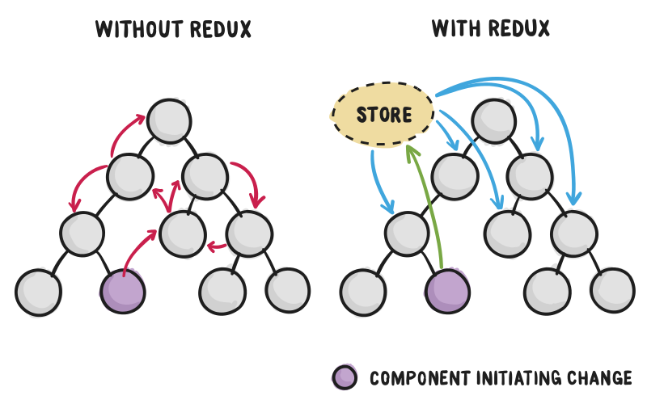
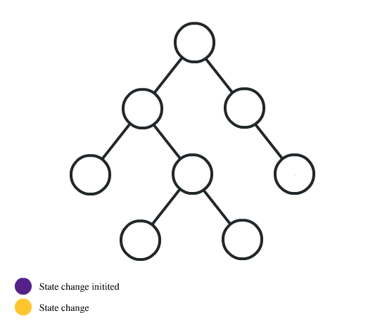
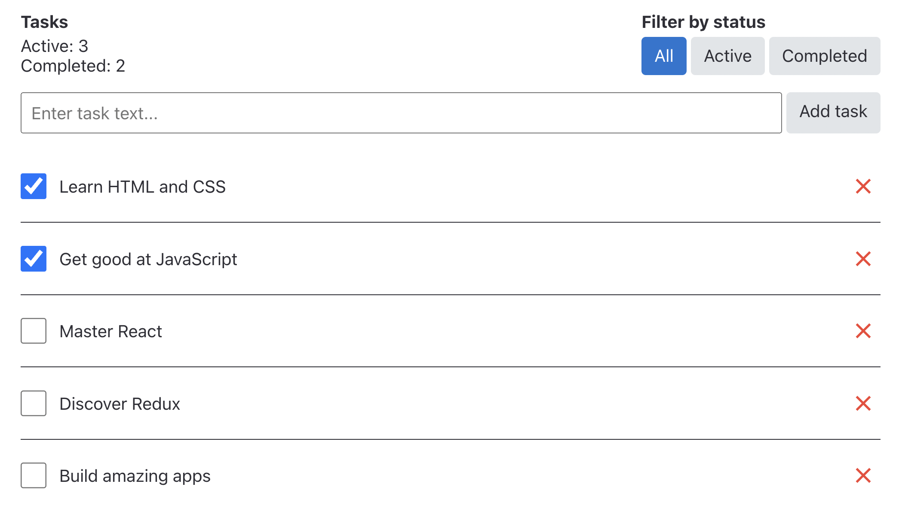
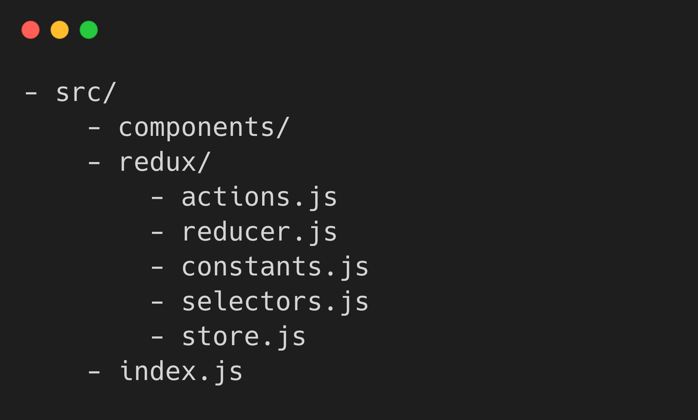
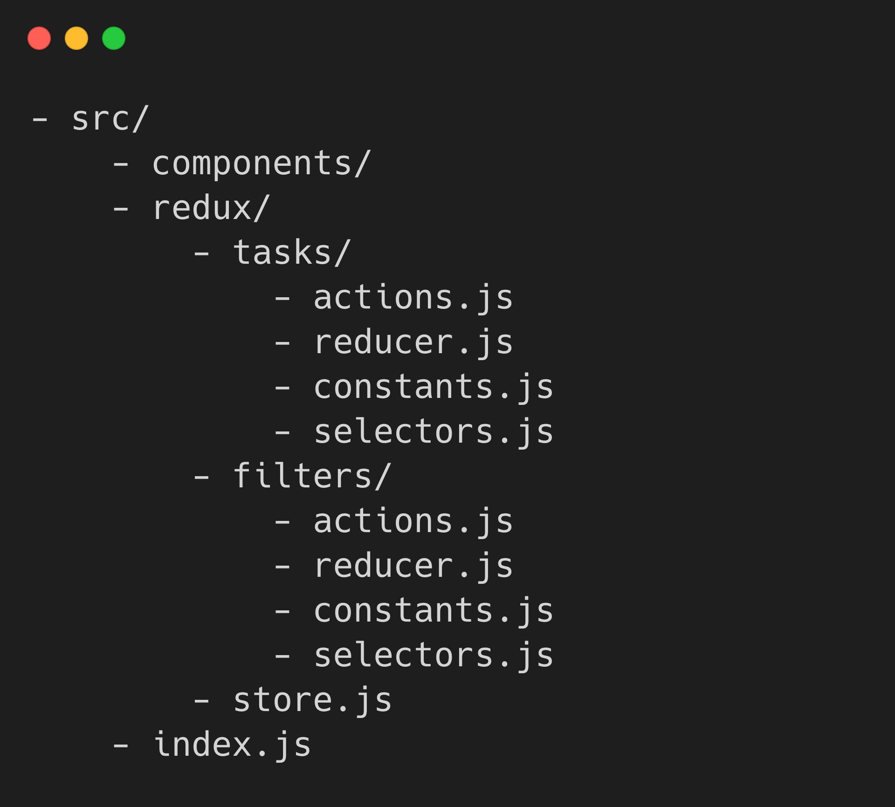

# **REDUX**

# Zarządzanie stanem


Wymagania do funkcjonalności aplikacji ciągle rosną, a w rezultacie zwiększa się ilość stanow interfejsu: asynchroniczne ładowanie danych, wskaźniki ładowania danych, wartości filtrów w trakcie sortowania, status formularzy itp. Biblioteki zarządzania stanem standaryzują przechowywanie statanu aplikacji i pracę z nim, upraszczając w ten sposób proces programowania.


Redux to jedna z najpopularniejszych bibliotek zarządzania statusem aplikacji.

- Przewidywalność wyników - zawsze istnieje jedno źródło prawdy, store (magazyn) kryjący w sobie status aplikacji i metody do pracy z nim.
-  Wspieranie - istnieje zbiór zasad i dobrych praktyk na temat tego, jak kod powinien być ustrukturyzowany, co czyni go bardziej jednorodnym i zrozumiałym.
- Narzędzia programisty - wygodne rozszerzenie przeglądarki, w którym dostarczane jest maksimum informacji o statusie aplikacji w trybie czasu rzeczywistego.


Flux

Redux opiera się na architekturze Flux. Flux to zaproponowany przez Facebooka wzór architektoniczny do budowy SPA (Single Page Application). Sugeruje podzielenie aplikacji na następujące części:

    Stores
    Dispatcher
    Views
    Actions


# Przepływ danych



Bez wykorzystania biblioteki zarządzania stanem, proces aktualizacji danych wygląda następująco:

- Status przechowywany jest w najbliższym wspólnym komponencie przodku.
- Zmienny status przerzucany jest przez propsy w dół drzewa komponentów.

Spójrz na animowaną ilustrację tego procesu, na której pokazany jest przykład zmiany statusu w różnych częściach aplikacji.




Dla niektórych komponenty występują jako przewodnicy, to znaczy otrzymują props tylko po to, aby przerzucić go głębiej, do komponentu, któremu jest naprawdę potrzebny. Na początku należy przerzucić przez całe drzewo komponentów metodę zmiany statusu, później sam status. To standardowy mechanizm przekazania propsów o kilka poziomów w głąb, nie można go zmienić.

Redux rozwiązuje ten problem poprzez utworzenie store (magazynu), który odpowiada za scentralizowane przechowywanie całego statusu i dostarcza zbioru zasad i metod do jego zmiany. Komponentom pozostaje wywołanie metody do aktualizacji danych i subskrypcja aktualizacji. W ten sposób Redux rozwiązuje problemy przekazywania propsów przez całe drzewo komponentów.


Strumień danych w Redux jest zawsze jednokierunkowy, od komponentów do store i od store do komponentów bez pośredników. To sprawia, że logika aplikacji jest bardziej przewidywalna i łatwa do zrozumienia.


- Użytkownik, pracując z interfejsem, inicjalizuje wysłanie actions (działań).
- Store wywołuje wszystkie zadeklarowane reducery, funkcje do zmiany statusu, przekazując im bieżący status (state) i action (działanie).
- Store przechowuje zaktualizowany status (state) zwracany z reducerów (reducers).
- Przy aktualizacji statusu (state) renderują się ponownie zależne od niego komponenty.
Plusy i minusy

Redux to tylko narzędzie do zarządzania statusem aplikacji, które przeznaczone jest do tego, aby pomóc odpowiedzieć na pytanie: "Kiedy i jak zmieniła się określona część statusu". Jeżeli nie masz problemu z zarządzaniem statusem, wykorzystując możliwości React, może być ci trudno zrozumieć plusy Redux. Być może status React to wszystko, co jest ci potrzebne do utworzenia aplikacji.

Wykorzystanie biblioteki zarządzania statusem nie powinno być przyjmowane jako obowiązkowe. Jeżeli aplikacja staje się tak skomplikowana, że nie rozumiesz, gdzie przechowywany jest status i jak się zmienia oraz zdecydujesz, że przechowywanie danych w statusie komponentu React jest niewystarczające, wtedy czas na użycie React.

Niemniej jednak wykorzystanie Redux wymaga kompromisów. Nie został on stworzony, aby być najkrótszym lub najszybszym sposobem pisania kodu. Redux stawia określone wymagania: przechowywać status aplikacji w postaci prostej struktury danych (store), opisywać zmiany obiektami (action) i opracowywać zmiany przy pomocy czystych funkcji (reducery).

 # Menadżer zadań

Będziemy analizować Redux na przykładzie aplikacji menadżera zadań, w którym można utworzyć, usunąć, anulować zadanie jako wykonane i filtrować zadania po statusie. Pozwoli to na analizę standardowych przypadków w trakcie pracy ze zbiorem danych.

W pierwszej kolejności opiszemy bazowe wymagania do interfejsu i logiki pracy aplikacji:

Interfejs powinien się składać z kilku części:

- Nagłówek z informacjami o zadaniach i filtrami
- Formularz z polem do wpisywania dla tworzenia nowych zadań
- Lista zadań
- W nagłówku należy wyświetlać:
        Ilość wykonanych i niewykonanych zadań
        Filtry listy zadań z wartościami «All», «Active» i «Completed»
- W każdym elemencie listy zadań powinien być:
        Akapit z tekstem, który do formularza wprowadzał użytkownik w trakcie tworzenia zadania
        Checkbox przełączenia statusu "wykonano"
        Przycisk usunięcia zadania

Ostateczny cel – aplikacja, której interfejs będzie wyglądał następująco:



# Projektowanie statusu

Interfejs aplikacji powinien opierać się na jego statusie. Z tego względu w pierwszej kolejności należy zaprojektować status aplikacji, który będzie zawierał najmniejszą ilość wartości, wystarczającą do opisania całej niezbędnej funkcjonalności. Zmniejszy to ilość danych, które trzeba będzie śledzić i aktualizować.

W twojej aplikacji są dwie podstawowe części: lista zadań, z której można otrzymać wszystkie niezbędne dane o ilości i statusie zadań i wartości filtrów listy zadań. To będzie właśnie minimalny niezbędny status.

```js
const appState = {
  tasks: [],
  filters: {
    status: "all",
  },
};
```

>:bulb::fire:
>STRUKTURA STATUSU
>
>Status Redux to zawsze obiekt, wewnątrz którego dodawane są właściwości dla statusu aplikacji. Dlatego zadeklarowaliśmy właściwość tasks dla tablicy wszystkich zadań i filters dla możliwych filtrów. Status Redux może być na tyle prosty lub skomplikowany, na ile wymaga tego funkcjonalność aplikacji.

Każde zadanie będzie przedstawiane jako obiekt z następującymi właściwościami:

- id - unikalny identyfikator
- text - tekst, który wprowadził użytkownik przy utworzeniu
- completed - flaga wskazująca, czy zadanie zostało wykonane, czy nie

A tak może wyglądać przykład statusu naszej aplikacji z kilkoma zadaniami:

```js
const appState = {
  tasks: [
    { id: 0, text: "Learn HTML and CSS", completed: true },
    { id: 1, text: "Get good at JavaScript", completed: true },
    { id: 2, text: "Master React", completed: false },
    { id: 3, text: "Discover Redux", completed: false },
    { id: 4, text: "Build amazing apps", completed: false },
  ],
  filters: {
    status: "all",
  },
};
```

Projektowanie akcji

Akcje to zdarzenia, które mogą zajść w aplikacji, w tym jako reakcja na działania użytkownika. Zrobimy listę zdarzeń, które mogą się znaleźć w naszej aplikacji:

- Dodać nowe zadanie z tekstem wprowadzonym przez użytkownika
-  Usunąć zadanie
-  Przełączyć status zadania
-  Zmienić wartość filtru statusu
-  

# Struktura plików projektu

W Redux nie ma standardu struktury plików projektu, tylko ogólne rekomendacje i przykłady, dlatego każdy może wybrać coś dla siebie. Niemniej jednak ważne, aby przemyśleć szablon struktury plików projektu jeszcze przed napisaniem kodu.

W celu oddzielenia logiki Redux od kodu komponentów wystarczy nam utworzyć folder z kilkoma plikami. W małej aplikacji, jak nasz menadżer zadań, to wystarczy.



- actions.js - plik deklarowania akcji w aplikacji
- reducer.js - plik deklarowania funkcji-reducerów do aktualizacji statusu
- constants.js - plik do przechowywania stałych (na przykład wartości filtru statusu)
- selectors.js - plik deklarowania funkcji-selektorów
- store.js - plik tworzenia store Redux

Jeżeli w aplikacji jest dużo różnych danych, to odpowiednie będzie podejście "feature based", gdzie dla każdej jednostki tworzy się oddzielny folder wewnątrz folderu redux. Wewnątrz każdej jednostki jest standardowy zestaw plików. W rezultacie otrzymujemy więcej plików, jednak kod logiki Redux został podzielony na jednostki i jest lepiej ustrukturyzowany.



# Store

Obiekt, który zawiera pełen status aplikacji, metody dostępu do statusu i wysyłania akcji. W aplikacji może być tylko jeden store. Do utworzenia store istnieje funkcja createStore(), która przyjmuje kilka parametrów i zwraca nowy obiekt store.

```js
createStore(reducer, preloadedState, enhancer)
```

- reducer - funkcja z logiką zmiany statusu Redux. Parametr obowiązkowy.
- preloadedState - początkowy status aplikacji. Powinien to być obiekt takiego samego kształtu, co przynajmniej część statusu.
- enhancer - funkcja rozszerzenia możliwości store. Parametr nieobowiązkowy.
```js

import { createStore } from "redux";

// Początkowa wartość statusu Redux dla Reducera root,
// jeżeli nie przekaże się parametru preloadedState. 
const initialState = {
  tasks: [
    { id: 0, text: "Learn HTML and CSS", completed: true },
    { id: 1, text: "Get good at JavaScript", completed: true },
    { id: 2, text: "Master React", completed: false },
    { id: 3, text: "Discover Redux", completed: false },
    { id: 4, text: "Build amazing apps", completed: false },
  ],
  filters: {
    status: "all",
  },
};

// Tymczasem wykorzystujemy reducer, który
// zwraca tylko otrzymany status
const rootReducer = (state = initialState, action) => {
  return state;
};

export const store = createStore(rootReducer);
```

Po utworzeniu store należy związać go z komponentami React, aby mogły otrzymywać dostęp do store i jego metod. W tym celu w bibliotece React Redux istnieje komponent Provider, który oczekuje jednoimiennego propsu store. Aby dowolny komponent w aplikacji mógł być wykorzystany przez store, owijamy w Provider całe drzewo komponentów.

```js

import ReactDOM from "react-dom/client";
import { Provider } from "react-redux";
import { store } from "./redux/store";

ReactDOM.createRoot(document.getElementById("root")).render(
  <Provider store={store}>
    <App />
  </Provider>
);
```

# Subskrypcja store

Aby otrzymać dane ze store, komponenty powinny subskrybować niezbędne dla nich części statusu Redux. W tym celu w bibliotece React Redux istnieje hook [useSelector(selector)](https://react-redux.js.org/api/hooks#useselector). Jako argument przyjmuje funkcję, która deklaruje jeden parametr state - cały obiekt statusu Redux, który zostanie automatycznie przekazany do funkcji poprzez hook useSelector. Ta funkcja nazywana jest selektorem i powinna zwrócić tylko tę część statusu, która jest niezbędna dla komponentu.


```js
// Importujemy hook import { useSelector } from "react-redux";const MyComponent = () => {// Otrzymujemy niezbędną część statusu  const value = useSelector(state => state.some.value);};
```

# Filtrowanie po statusie
Zapisujemy możliwe wartości filtra w postaci obiektu, aby ponownie wykorzystywać je w różnych miejscach aplikacji: w komponencie StatusFilter do obliczenia bieżącego aktywnego filtra i wysłania akcji zmiany filtra, w komponencie TaskList do obliczenia listy widocznych zadań, a także funkcji reducera, w której będziemy później opracowywać action zmiany filtra.

```js

export const statusFilters = Object.freeze({  all: "all",  active: "active",  completed: "completed",});
```

>:bulb:OBJECT.FREEZE()
>
>Wykorzystujemy metodę [Object.freeze()](https://developer.mozilla.org/en-US/docs/Web/JavaScript/Reference/Global_Objects/Object/freeze) aby "zamrozić" obiekt wartości filtra i zapobiec jego przypadkowej zmianie po odnośniku w miejscach importu.

Komponentowi StatusFilter potrzebna jest wartość filtra z właściwości statusFilter statusu Redux, dlatego funkcja selektor będzie wyglądać jak state => state.filters.status.

```js

// Importujemy hook
import { useSelector } from "react-redux";
// Importujemy obiekt wartości filtra
import { statusFilters } from "../../redux/constants";

export const StatusFilter = () => {
  // Otrzymujemy wartość filtra ze statusu Redux
  const filter = useSelector(state => state.filters.status);

  return (
    <div>
      <Button selected={filter === statusFilters.all}>All</Button>
      <Button selected={filter === statusFilters.active}>Active</Button>
      <Button selected={filter === statusFilters.completed}>Completed</Button>
    </div>
  );
};
```

# Lista zadań

Komponentowi TaskList niezbędna jest tablica zadań z właściwości tasks i wartość filtra z właściwości statusFilter. Na bazie tych wartości możemy obliczyć tablicę zadań, które należy zrenderować w interfejsie.

```js

// Importujemy hook
import { useSelector } from "react-redux";
import { Task } from "components/Task/Task";
// Importujemy obiekt wartości filtra
import { statusFilters } from "../../redux/constants";

const getVisibleTasks = (tasks, statusFilter) => {
  switch (statusFilter) {
    case statusFilters.active:
      return tasks.filter(task => !task.completed);
    case statusFilters.completed:
      return tasks.filter(task => task.completed);
    default:
      return tasks;
  }
};

export const TaskList = () => {
  // Otrzymujemy tablicę zadań ze statusu Redux
  const tasks = useSelector(state => state.tasks);
  // Otrzymujemy wartość filtra ze statusu Redux
  const statusFilter = useSelector(state => state.filters.status);
  // Obliczamy tablicę zadań, które należy wyświetlić w interfejsie
  const visibleTasks = getVisibleTasks(tasks, statusFilter);

  return (
    <ul>
      {visibleTasks.map(task => (
        <li key={task.id}>
          <Task task={task} />
        </li>
      ))}
    </ul>
  );
};
```

>:bulb:GDZIE SĄ PROPSY?
>
>Zwróć uwagę na to, że w komponencie TaskList nie ma propsów, jak przy wykorzystaniu statusu React. Komponent App nie musi teraz wiedzieć o tym, że TaskList subskrybuje dane ze store. Wykorzystując Redux, dowolny komponent może bezpośrednio otrzymać dostęp do wartości ze statusu Redux, jeśli jest taka potrzeba.

# Licznik zadań
Komponentowi TaskCounter niezbędna jest tablica zadań z właściwości tasks statusu Redux, dlatego funkcja selektor będzie wyglądała jak state => state.tasks. Na podstawie tych danych możemy obliczyć dane pochodne ilości aktywnych i wykonanych zadań.

```js

// Importujemy hook
import { useSelector } from "react-redux";

export const TaskCounter = () => {
  // Otrzymujemy tablicę zadań ze statusu Redux
  const tasks = useSelector(state => state.tasks);

  // Na bazie stausu Redux otrzymujemy dane pochodne
  const count = tasks.reduce(
    (acc, task) => {
      if (task.completed) {
        acc.completed += 1;
      } else {
        acc.active += 1;
      }
      return acc;
    },
    { active: 0, completed: 0 }
  );

  return (
    <div>
      <p>Active: {count.active}</p>
      <p>Completed: {count.completed}</p>
    </div>
  );
};
```

# Funkcje selektory
Ten sam selektor można wykorzystywać w kilku miejscach aplikacji, co prowadzi do dublowania kodu, jak na przykład w naszych komponentach TaskList, StatusFilter i TaskCounter. Aby tego uniknąć i jeszcze bardziej ustrukturyzować kod, wszystkie funkcje selektory deklaruje się w oddzielnym pliku, na przykład w src/redux/selectors.js, po czym są importowane do komponentów.

```js

export const getTasks = state => state.tasks;export const getStatusFilter = state => state.filters.status;
```

>:bulb:JEDNO ŹRÓDŁO PRAWDY
>
>Deklarowanie funkcji selektorów wewnątrz komponentów jest dobre również dlatego, że komponenty nie wiedzą o kształcie statusu Redux, i w przypadku jego zmiany wystarczy zredagowanie kodu jednego pliku, a nie szukanie selektorów po kodzie wszystkich komponentów aplikacji.