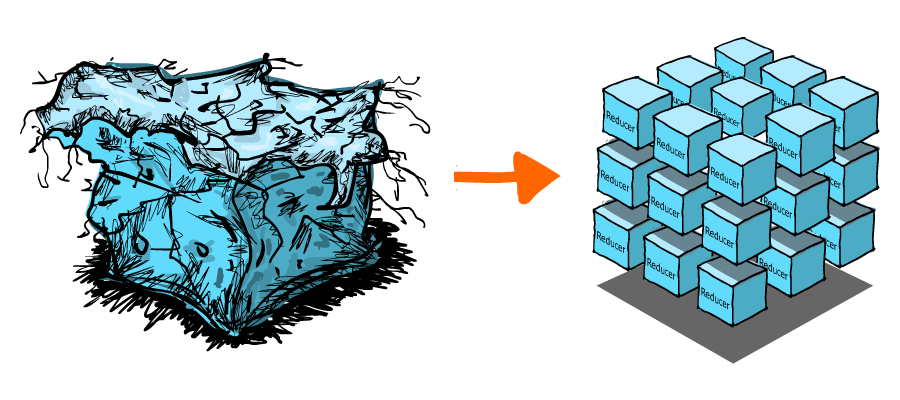

# **REDUX**

# Zarządzanie stanem


Wymagania do funkcjonalności aplikacji ciągle rosną, a w rezultacie zwiększa się ilość stanow interfejsu: asynchroniczne ładowanie danych, wskaźniki ładowania danych, wartości filtrów w trakcie sortowania, status formularzy itp. Biblioteki zarządzania stanem standaryzują przechowywanie statanu aplikacji i pracę z nim, upraszczając w ten sposób proces programowania.





Redux to jedna z najpopularniejszych bibliotek zarządzania statusem aplikacji.

- Przewidywalność wyników - zawsze istnieje jedno źródło prawdy, store (magazyn) kryjący w sobie status aplikacji i metody do pracy z nim.
-  Wspieranie - istnieje zbiór zasad i dobrych praktyk na temat tego, jak kod powinien być ustrukturyzowany, co czyni go bardziej jednorodnym i zrozumiałym.
- Narzędzia programisty - wygodne rozszerzenie przeglądarki, w którym dostarczane jest maksimum informacji o statusie aplikacji w trybie czasu rzeczywistego.


Flux

Redux opiera się na architekturze Flux. Flux to zaproponowany przez Facebooka wzór architektoniczny do budowy SPA (Single Page Application). Sugeruje podzielenie aplikacji na następujące części:

    Stores
    Dispatcher
    Views
    Actions


# Przepływ danych


Bez wykorzystania biblioteki zarządzania stanem, proces aktualizacji danych wygląda następująco:

- Status przechowywany jest w najbliższym wspólnym komponencie przodku.
- Zmienny status przerzucany jest przez propsy w dół drzewa komponentów.

Spójrz na animowaną ilustrację tego procesu, na której pokazany jest przykład zmiany statusu w różnych częściach aplikacji.


Dla niektórych komponenty występują jako przewodnicy, to znaczy otrzymują props tylko po to, aby przerzucić go głębiej, do komponentu, któremu jest naprawdę potrzebny. Na początku należy przerzucić przez całe drzewo komponentów metodę zmiany statusu, później sam status. To standardowy mechanizm przekazania propsów o kilka poziomów w głąb, nie można go zmienić.

Redux rozwiązuje ten problem poprzez utworzenie store (magazynu), który odpowiada za scentralizowane przechowywanie całego statusu i dostarcza zbioru zasad i metod do jego zmiany. Komponentom pozostaje wywołanie metody do aktualizacji danych i subskrypcja aktualizacji. W ten sposób Redux rozwiązuje problemy przekazywania propsów przez całe drzewo komponentów.


Strumień danych w Redux jest zawsze jednokierunkowy, od komponentów do store i od store do komponentów bez pośredników. To sprawia, że logika aplikacji jest bardziej przewidywalna i łatwa do zrozumienia.


- Użytkownik, pracując z interfejsem, inicjalizuje wysłanie actions (działań).
- Store wywołuje wszystkie zadeklarowane reducery, funkcje do zmiany statusu, przekazując im bieżący status (state) i action (działanie).
- Store przechowuje zaktualizowany status (state) zwracany z reducerów (reducers).
- Przy aktualizacji statusu (state) renderują się ponownie zależne od niego komponenty.
Plusy i minusy

Redux to tylko narzędzie do zarządzania statusem aplikacji, które przeznaczone jest do tego, aby pomóc odpowiedzieć na pytanie: "Kiedy i jak zmieniła się określona część statusu". Jeżeli nie masz problemu z zarządzaniem statusem, wykorzystując możliwości React, może być ci trudno zrozumieć plusy Redux. Być może status React to wszystko, co jest ci potrzebne do utworzenia aplikacji.

Wykorzystanie biblioteki zarządzania statusem nie powinno być przyjmowane jako obowiązkowe. Jeżeli aplikacja staje się tak skomplikowana, że nie rozumiesz, gdzie przechowywany jest status i jak się zmienia oraz zdecydujesz, że przechowywanie danych w statusie komponentu React jest niewystarczające, wtedy czas na użycie React.

Niemniej jednak wykorzystanie Redux wymaga kompromisów. Nie został on stworzony, aby być najkrótszym lub najszybszym sposobem pisania kodu. Redux stawia określone wymagania: przechowywać status aplikacji w postaci prostej struktury danych (store), opisywać zmiany obiektami (action) i opracowywać zmiany przy pomocy czystych funkcji (reducery).

 # Menadżer zadań

Będziemy analizować Redux na przykładzie aplikacji menadżera zadań, w którym można utworzyć, usunąć, anulować zadanie jako wykonane i filtrować zadania po statusie. Pozwoli to na analizę standardowych przypadków w trakcie pracy ze zbiorem danych.

W pierwszej kolejności opiszemy bazowe wymagania do interfejsu i logiki pracy aplikacji:

Interfejs powinien się składać z kilku części:

- Nagłówek z informacjami o zadaniach i filtrami
- Formularz z polem do wpisywania dla tworzenia nowych zadań
- Lista zadań
- W nagłówku należy wyświetlać:
        Ilość wykonanych i niewykonanych zadań
        Filtry listy zadań z wartościami «All», «Active» i «Completed»
- W każdym elemencie listy zadań powinien być:
        Akapit z tekstem, który do formularza wprowadzał użytkownik w trakcie tworzenia zadania
        Checkbox przełączenia statusu "wykonano"
        Przycisk usunięcia zadania

Ostateczny cel – aplikacja, której interfejs będzie wyglądał następująco:


# Projektowanie statusu

Interfejs aplikacji powinien opierać się na jego statusie. Z tego względu w pierwszej kolejności należy zaprojektować status aplikacji, który będzie zawierał najmniejszą ilość wartości, wystarczającą do opisania całej niezbędnej funkcjonalności. Zmniejszy to ilość danych, które trzeba będzie śledzić i aktualizować.

W twojej aplikacji są dwie podstawowe części: lista zadań, z której można otrzymać wszystkie niezbędne dane o ilości i statusie zadań i wartości filtrów listy zadań. To będzie właśnie minimalny niezbędny status.

```js
const appState = {
  tasks: [],
  filters: {
    status: "all",
  },
};
```

>:bulb::fire:
>STRUKTURA STATUSU
>
>Status Redux to zawsze obiekt, wewnątrz którego dodawane są właściwości dla statusu aplikacji. Dlatego zadeklarowaliśmy właściwość tasks dla tablicy wszystkich zadań i filters dla możliwych filtrów. Status Redux może być na tyle prosty lub skomplikowany, na ile wymaga tego funkcjonalność aplikacji.

Każde zadanie będzie przedstawiane jako obiekt z następującymi właściwościami:

- id - unikalny identyfikator
- text - tekst, który wprowadził użytkownik przy utworzeniu
- completed - flaga wskazująca, czy zadanie zostało wykonane, czy nie

A tak może wyglądać przykład statusu naszej aplikacji z kilkoma zadaniami:

```js
const appState = {
  tasks: [
    { id: 0, text: "Learn HTML and CSS", completed: true },
    { id: 1, text: "Get good at JavaScript", completed: true },
    { id: 2, text: "Master React", completed: false },
    { id: 3, text: "Discover Redux", completed: false },
    { id: 4, text: "Build amazing apps", completed: false },
  ],
  filters: {
    status: "all",
  },
};
```

Projektowanie akcji

Akcje to zdarzenia, które mogą zajść w aplikacji, w tym jako reakcja na działania użytkownika. Zrobimy listę zdarzeń, które mogą się znaleźć w naszej aplikacji:

- Dodać nowe zadanie z tekstem wprowadzonym przez użytkownika
-  Usunąć zadanie
-  Przełączyć status zadania
-  Zmienić wartość filtru statusu
-  

# Struktura plików projektu

W Redux nie ma standardu struktury plików projektu, tylko ogólne rekomendacje i przykłady, dlatego każdy może wybrać coś dla siebie. Niemniej jednak ważne, aby przemyśleć szablon struktury plików projektu jeszcze przed napisaniem kodu.

W celu oddzielenia logiki Redux od kodu komponentów wystarczy nam utworzyć folder z kilkoma plikami. W małej aplikacji, jak nasz menadżer zadań, to wystarczy.


- actions.js - plik deklarowania akcji w aplikacji
- reducer.js - plik deklarowania funkcji-reducerów do aktualizacji statusu
- constants.js - plik do przechowywania stałych (na przykład wartości filtru statusu)
- selectors.js - plik deklarowania funkcji-selektorów
- store.js - plik tworzenia store Redux

Jeżeli w aplikacji jest dużo różnych danych, to odpowiednie będzie podejście "feature based", gdzie dla każdej jednostki tworzy się oddzielny folder wewnątrz folderu redux. Wewnątrz każdej jednostki jest standardowy zestaw plików. W rezultacie otrzymujemy więcej plików, jednak kod logiki Redux został podzielony na jednostki i jest lepiej ustrukturyzowany.

